# Harbor

> **A guaranteed-settlement layer for FXRP redemptions on Flare — now with a
> destination-tag redemption lane.**

[](LICENSE)


Harbor sits between an FXRP redeemer and the agent that owes them XRP. When you
redeem FXRP on Flare, an agent has a fixed window to deliver the underlying XRP
on the XRP Ledger. If the agent pays, the redemption **settles**; if the window
lapses, you are owed vault collateral instead — but **only** if someone notices
the miss, assembles a cryptographic proof of non-payment, and submits the
default on-chain before the request is cleaned up. Most redeemers never do.

Harbor closes that gap **without ever custodying funds**. You redeem directly on
the FXRP `AssetManager` and nominate Harbor's on-chain executor; from there a
keeper watches each request end to end. It confirms the agent's XRPL payment
from the ledger itself, or — when the window expires — builds a Flare Data
Connector (FDC) proof of non-payment, waits for it to finalize, and triggers the
on-chain default so your collateral is recovered automatically. If the keeper is
ever unavailable, **anyone can finish a stuck default straight from the UI**,
because the executor path is permissionless by design.

Harbor tracks **two parallel redemption lanes** through that same lifecycle:

- **Standard** — `redeemAmount(...)` settled/defaulted with the FDC
  `ReferencedPaymentNonexistence` proof and `HarborRedeemer.executeDefault`.
- **Redeem-by-tag** — `redeemWithTag(...)` for XRPL destinations that require a
  **destination tag** (exchanges, custodians), settled/defaulted with the
  XRP-native `XRPPaymentNonexistence` proof and `HarborRedeemer.executeXrpDefault`.

Around that core, Harbor indexes live FAssets activity, surfaces official agent
identity and observed reliability as **informational network analytics**, and
presents the whole lifecycle — redeem, settle, or recover — through a responsive
Next.js console.

The system drives one settlement lifecycle end to end:

> **redeem → watch XRPL → settle · or prove non-payment → execute default → recover collateral**

|             |                                                                                            |
| ----------- | ------------------------------------------------------------------------------------------ |
| Live demo   | [harbor-web-olive.vercel.app](https://harbor-web-olive.vercel.app)                         |
| Backend API | [api-production-6f3ec.up.railway.app](https://api-production-6f3ec.up.railway.app)         |
| Walkthrough | ▶ [Watch the 2-minute walkthrough on YouTube](https://www.youtube.com/watch?v=97Q2v0fn6VI) |

[](https://www.youtube.com/watch?v=97Q2v0fn6VI)

<p align="center"><em>▶ <a href="https://www.youtube.com/watch?v=97Q2v0fn6VI">Watch the 2-minute walkthrough</a> — redeem → watch XRPL → settle, or prove non-payment → execute default → recover collateral.</em></p>

---

## Table of contents

- [Project status](#project-status)
- [Why Harbor](#why-harbor)
- [Features](#features)
- [How Harbor works](#how-harbor-works)
- [The two redemption lanes](#the-two-redemption-lanes)
- [Architecture](#architecture)
- [Component relationships](#component-relationships)
- [Repository layout](#repository-layout)
- [Sequence diagrams](#sequence-diagrams)
- [The settlement keeper](#the-settlement-keeper)
- [Getting started](#getting-started)
- [Configuration](#configuration)
- [Usage](#usage)
- [Build on Harbor](#build-on-harbor)
- [Implementation notes](#implementation-notes)
- [Data model](#data-model)
- [On-chain deployment](#on-chain-deployment)
- [Development](#development)
- [Testing](#testing)
- [Roadmap](#roadmap)
- [Documentation](#documentation)
- [Contributing](#contributing)
- [License](#license)

---

## Project status

Harbor is maintained as a portfolio project and runs entirely on the Flare
**Coston2** testnet. It is a working, production-shaped MVP rather than a
commercial product: the `HarborRedeemer` contract is deployed on Coston2, the
backend indexes and settles live redemptions (both the **standard** and
**redeem-by-tag** lanes), and the console is public for review. It is
deliberately scoped to testnet — the deployment tooling refuses mainnet,
Songbird, and production targets, and agent reliability scores are explicit
heuristics, never a settlement guarantee.

The full redeem → settle and redeem → default → recover lifecycles have been
verified live on Coston2 for both lanes, including an on-chain FXRP mint,
`redeemWithTag` support detection, and a permissionless `executeXrpDefault`
recovery. The repository is kept as a reference implementation, and changes land
at a maintenance pace.

> [!NOTE]
> Harbor never holds your FXRP or the redeemer role. FAssets pays default
> collateral to the recorded redeemer, so recovered collateral always goes to
> **you** — the worst case if Harbor disappears is that you submit
> `executeDefault` / `executeXrpDefault` yourself.

## Why Harbor

The FAssets redemption default is a real protection, but a manual one. A
redeemer who is owed XRP and does not receive it has to monitor the agent's XRPL
address, detect that the payment window closed without a valid payment, request
a Flare Data Connector non-payment attestation, wait for its voting round to
finalize, retrieve the Merkle proof from the data-availability layer, and only
then call the correct on-chain default entrypoint with that proof — correctly,
and before the request is gone. Every step is easy to miss and easy to get
wrong, so in practice the guarantee often goes unclaimed.

Harbor turns that manual burden into infrastructure without inserting itself
into custody. Three cooperating parts enforce it:

1. **A permissionless on-chain executor** — `HarborRedeemer` is nominated as the
   redemption executor and exposes two entry points anyone can call:
   `executeDefault(proof, requestId)` for standard redemptions and
   `executeXrpDefault(proof, requestId)` for redeem-by-tag redemptions. Each
   forwards to the `AssetManager` and returns the executor fee to whoever
   submitted the transaction.
2. **A settlement keeper** — a deterministic, per-redemption state machine that
   watches the payment window, confirms XRPL settlement, and otherwise drives
   the full non-payment proof and default flow to completion — automatically
   selecting the correct proof type and default lane per redemption.
3. **A reliability & identity layer** — an indexer, official FAssets agent
   details (name/icon), a heuristic agent score, and a read API that surface
   observed agent reliability as **informational network analytics** and let a
   redeemer follow a request's settlement. This is analytics only: the protocol
   assigns redemption agents **FIFO**, so nothing here selects or influences
   which agent fulfills a redemption.

Because Harbor never holds the FAsset or the redeemer role — FAssets pays
default collateral to the recorded redeemer, so Harbor intentionally never wraps
`redeem` — recovered collateral always goes to the user, and the worst case if
Harbor disappears is that a redeemer submits the default themselves.

## Features

- **Non-custodial by construction.** Harbor never wraps `redeem` and never holds
  the FAsset. You redeem on the `AssetManager` directly and nominate the Harbor
  executor, so default collateral is always paid to you.
- **Automatic default recovery.** The keeper detects a missed payment window,
  proves non-payment through the FDC, and submits the on-chain default without
  any action from the redeemer.
- **Redeem-by-tag (destination tags).** First-class support for FXRP redemptions
  that require an XRPL **destination tag** (exchanges and custodials). An
  optional tag input routes to `AssetManager.redeemWithTag`; the agent's XRPL
  payment must carry that exact `DestinationTag` to settle, and a missed payment
  is defaulted through the XRP-native FDC `XRPPaymentNonexistence` proof and the
  permissionless `HarborRedeemer.executeXrpDefault` entrypoint — the tag-lane
  mirror of the standard non-payment default. Tag `0` is a valid tag; an empty
  input means the standard `redeemAmount` path.
- **Redeem any amount.** The console redeems an arbitrary FXRP amount (decimals
  supported) via `redeemAmount`, converted to exact base units (UBA) with
  bigint arithmetic — never floating point. There is no lot-based input path.
- **No agent selection — FIFO by protocol.** FAssets assigns the backing
  agent(s) from the front of its redemption queue. The console never asks you to
  pick, prefer, or target an agent; the assigned agent is shown afterward as a
  fact read from indexed protocol data.
- **Permissionless self-recovery.** Every default is submittable by anyone. The
  console decodes the prepared FDC proof and calls the correct entrypoint
  (`executeDefault` or `executeXrpDefault`) from a connected wallet, so a stuck
  request is never stranded on the keeper.
- **Proof-carrying, not trust-carrying.** Defaults are only ever executed
  against a finalized FDC proof; the UI reuses the exact proof bytes the backend
  assembled and never accepts hand-supplied JSON.
- **Official agent identity.** Agents' published `AgentOwnerRegistry` details
  (name, description, icon, terms of use) are read on-chain and joined into the
  statistics and status views, with a clean fallback to the vault address when
  an agent has published nothing.
- **Evidence-based status timeline.** A request's timeline is built from
  concrete stored evidence — the on-chain request, XRPL settlement receipts, FDC
  requests and proofs, and the submitted default — not from an inferred state
  path.
- **Fast XRPL settlement signal.** An optional observer polls the agent's XRPL
  address and records a validated settlement receipt the moment the payment
  lands, independent of the on-chain event stream, matching against the **net**
  underlying amount (`valueUBA − feeUBA`) and — for tag redemptions — the exact
  destination tag.
- **Heuristic agent reliability.** A transparent, term-by-term score
  (`agent-reliability-mvp-v1`) ranks agents on fulfillment, settlement speed,
  availability, and collateral — the collateral ratio derived from live FTSOv2
  prices — and is always flagged as a heuristic.
- **Durable indexing.** The FAssets indexer backfills from a persisted cursor on
  a poll loop, so events emitted during a restart, redeploy, or RPC gap are
  recovered instead of lost.
- **Responsive, desktop-first console.** A 1280px container system with a
  two-zone overview, a monitoring-dashboard agents page, and a status page that
  splits into a wide narrative column and a sticky detail rail — with full dark
  mode.
- **Runs with zero configuration.** Every service flag and every `NEXT_PUBLIC_*`
  value has a safe local default, so the API and console boot in "mock mode"
  with no secrets.
- **Build on Harbor.** A public, `GET`-only read API plus a drop-in embeddable
  widget and React component, so wallets, explorers, and protocols can surface
  agent reliability and settlement status with no contract calls and no custody.

## How Harbor works

A redemption is a single lifecycle with exactly one on-chain crossing point on
the way in (your `redeem` call) and one on the way out (settlement _or_ default).
Everything Harbor adds in between is off-chain automation that only ever calls
the permissionless executor.

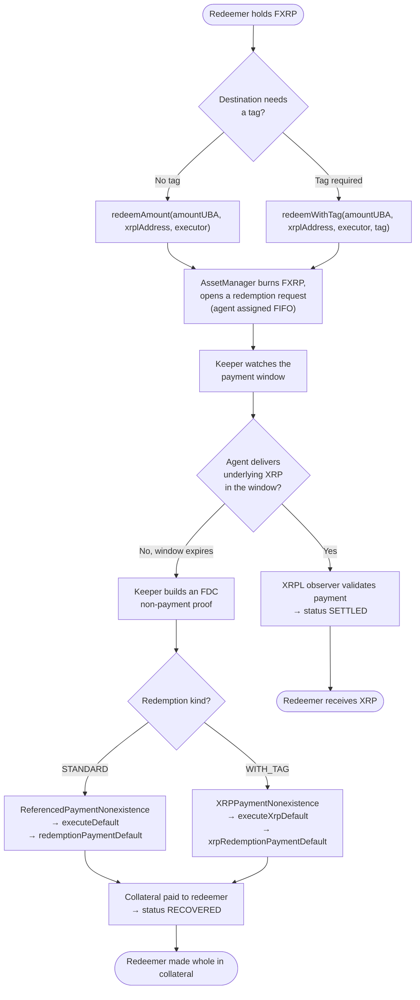

The redeemer's only transaction is the `redeem` call. From that point Harbor's
keeper drives the request to a terminal outcome — `SETTLED` if the agent pays,
`RECOVERED` if it does not — and the permissionless executor guarantees the
default can always be completed even if the keeper is offline.

## The two redemption lanes

Harbor tracks every redemption as one of two **kinds**, discriminated by
`redemptionKind`. The kind is chosen at redeem time (by whether a destination
tag is supplied), persisted on the request, and then used to select the XRPL
settlement matcher, the FDC attestation type, and the on-chain default
entrypoint. **The lanes are strictly isolated** — a kind/proof mismatch is
rejected before any transaction is sent — and the standard path is fully
backward-compatible (pre-existing rows default to `STANDARD`).

| Aspect                      | `STANDARD`                                    | `WITH_TAG` (redeem-by-tag)                         |
| --------------------------- | --------------------------------------------- | -------------------------------------------------- |
| Redeem call                 | `redeemAmount(amountUBA, address, executor)`  | `redeemWithTag(amountUBA, address, executor, tag)` |
| On-chain request event      | `RedemptionRequested`                         | `RedemptionWithTagRequested`                       |
| XRPL settlement match       | destination + reference + net amount + window | the above **plus an exact `DestinationTag` match** |
| FDC non-payment attestation | `ReferencedPaymentNonexistence`               | `XRPPaymentNonexistence` (XRP-native)              |
| Harbor default entrypoint   | `executeDefault(proof, id)`                   | `executeXrpDefault(proof, id)`                     |
| AssetManager default call   | `redemptionPaymentDefault`                    | `xrpRedemptionPaymentDefault`                      |
| When to use                 | any XRPL address that needs no tag            | exchange / custodial addresses that require a tag  |

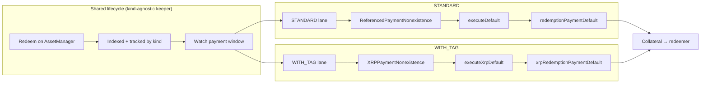

> [!IMPORTANT]
> Tag `0` is a **valid** destination tag. An empty/absent tag input means
> `STANDARD`; an explicit `0` means `WITH_TAG` with `destinationTag = 0`. The
> console additionally reads `AssetManager.redeemWithTagSupported()` and
> gracefully disables the tag input when the protocol reports the capability is
> unavailable, so the standard lane is never blocked by a transient read.

## Architecture

The pipeline is a single settlement lifecycle with one on-chain crossing point.
Everything the redeemer touches happens on the `AssetManager`; everything Harbor
adds is off-chain automation that only ever calls the permissionless executor.
The keeper is **kind-agnostic**: it drives both lanes through the same state
machine and delegates lane-specific proof building and default submission to the
FDC pipeline and default executor.

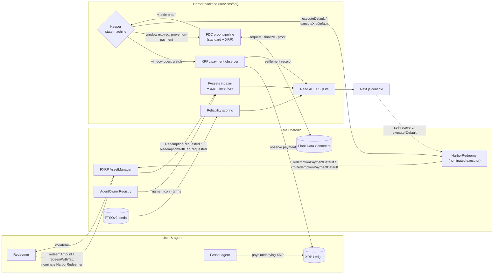

Each stage is an isolated module with a narrow contract:

| Stage         | Module                                                                   | Responsibility                                                                                                     |
| ------------- | ------------------------------------------------------------------------ | ------------------------------------------------------------------------------------------------------------------ |
| Executor      | [`contracts/src/HarborRedeemer.sol`](./contracts/src/HarborRedeemer.sol) | Permissionless default executor (both lanes); forwards to the AssetManager and refunds the caller's fee.           |
| Indexer       | [`services/api/src/indexer`](./services/api/src/indexer)                 | Durable FAssets event indexer, agent inventory, and official agent-details reader.                                 |
| XRPL observer | [`services/api/src/xrpl`](./services/api/src/xrpl)                       | Confirms the agent's underlying payment (and destination tag) directly from the XRP Ledger.                        |
| Keeper        | [`services/api/src/keeper`](./services/api/src/keeper)                   | Kind-agnostic per-redemption state machine: watch → settle, or prove → default.                                    |
| FDC           | [`services/api/src/fdc`](./services/api/src/fdc)                         | Builds, submits, finalizes, and retrieves `ReferencedPaymentNonexistence` **and** `XRPPaymentNonexistence` proofs. |
| Scoring       | [`services/api/src/scoring`](./services/api/src/scoring)                 | Heuristic agent reliability from redemption history and FTSOv2 collateral.                                         |
| API           | [`services/api/src/api`](./services/api/src/api)                         | Read-only HTTP surface over the SQLite store.                                                                      |
| Web           | [`apps/web`](./apps/web)                                                 | Next.js console: redeem (any amount + optional tag), status timeline, agent statistics, self-recovery.             |
| Protocol      | [`packages/protocol`](./packages/protocol)                               | Chain data, addresses, ABIs (incl. XRP attestation tuples), generated `HarborRedeemer` artifact.                   |
| Shared        | [`packages/shared`](./packages/shared)                                   | Domain types (kinds, destination tags, agent details), DTOs, env parsing, bigint-safe JSON.                        |

## Component relationships

Harbor is a pnpm monorepo. `@harbor/shared` and `@harbor/protocol` are the two
leaf packages both the backend and the console build on, so protocol constants
and domain types have a single source of truth.

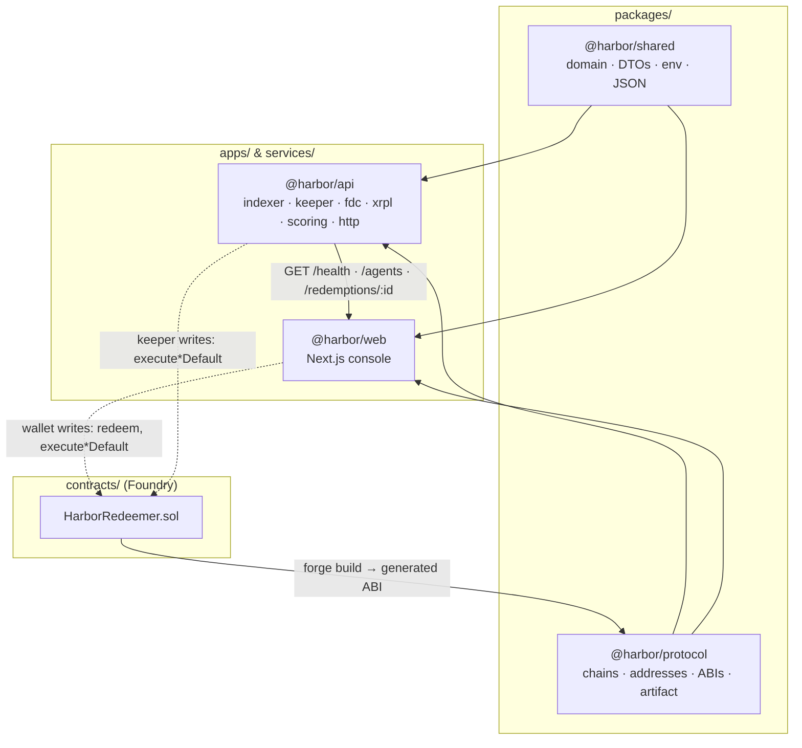

## Repository layout

```
.
├── apps/
│   └── web/                 Next.js 14 App Router console
│       └── src/
│           ├── app/         routes: / (overview + redeem) · /agents · /status/[id]
│           ├── components/  overview · redemption · status · agents · ui primitives
│           └── lib/         api client, wagmi/viem, formatting, tag + proof decoding
├── services/
│   └── api/                 composable Node service (API · indexer · keeper · observer)
│       └── src/
│           ├── api/         HTTP server, routes, health, CORS, errors
│           ├── db/          SQLite connection + migrations (0001–0007)
│           ├── indexer/     FAssets events + agent inventory + agent details
│           ├── keeper/      redemption state machine + dual-lane default executor
│           ├── fdc/         Flare Data Connector pipeline (standard + XRP nonexistence)
│           ├── xrpl/        XRPL payment + destination-tag observer
│           ├── scoring/     agent reliability + FTSO prices
│           └── repositories/ typed data-access layer over SQLite
├── packages/
│   ├── protocol/            chains, addresses, ABIs, HarborRedeemer artifact
│   └── shared/              domain types, DTOs, env, JSON/normalize helpers
├── contracts/               Foundry project — HarborRedeemer.sol
├── test/e2e/                live Coston2 end-to-end suites (standard + tag)
└── assets/                  screenshots and demo media
```

## Sequence diagrams

### Happy path — the agent pays (settlement)

Applies to both lanes. The XRPL observer provides a fast, ledger-sourced
settlement signal, so the request settles as soon as a valid payment lands —
without waiting on the on-chain `RedemptionPerformed` event.

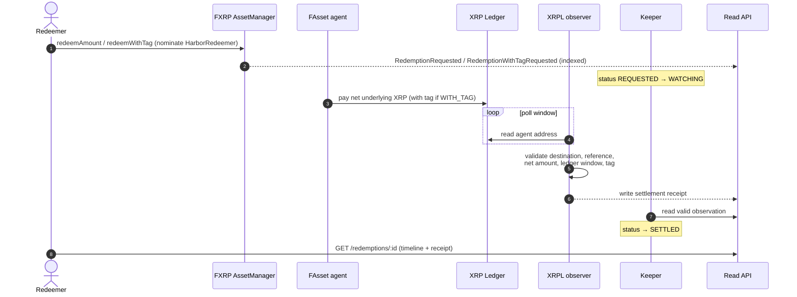

### Non-payment — standard lane default recovery

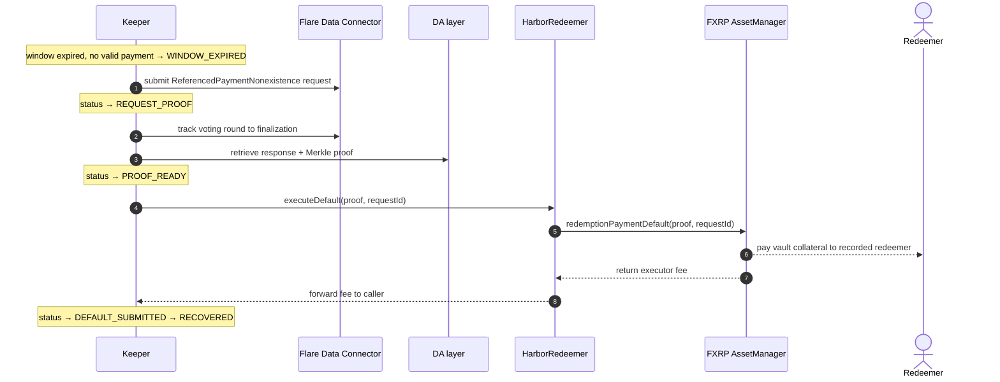

### Non-payment — redeem-by-tag lane default recovery

The tag lane mirrors the standard lane but uses the XRP-native attestation and
default entrypoint. The FDC request body carries the destination tag and a
first-memo-data hash instead of a standard payment reference.

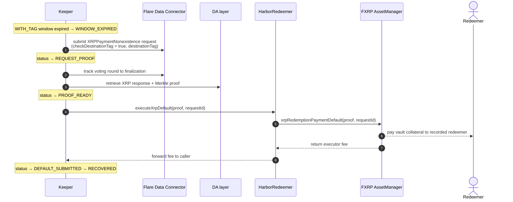

### Permissionless self-recovery (from the UI)

If the keeper is offline, anyone can complete a default from the console using
the already-prepared proof exposed by the API.

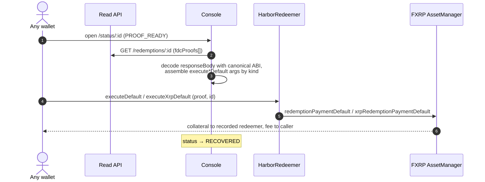

## The settlement keeper

The keeper is a deterministic state machine evaluated per redemption. Each
request moves through an explicit lifecycle, every transition is recorded, and
work is idempotent and backed by a durable job table, so restarts resume rather
than duplicate. The same machine drives both lanes; only proof building and
default submission differ by `redemptionKind`.

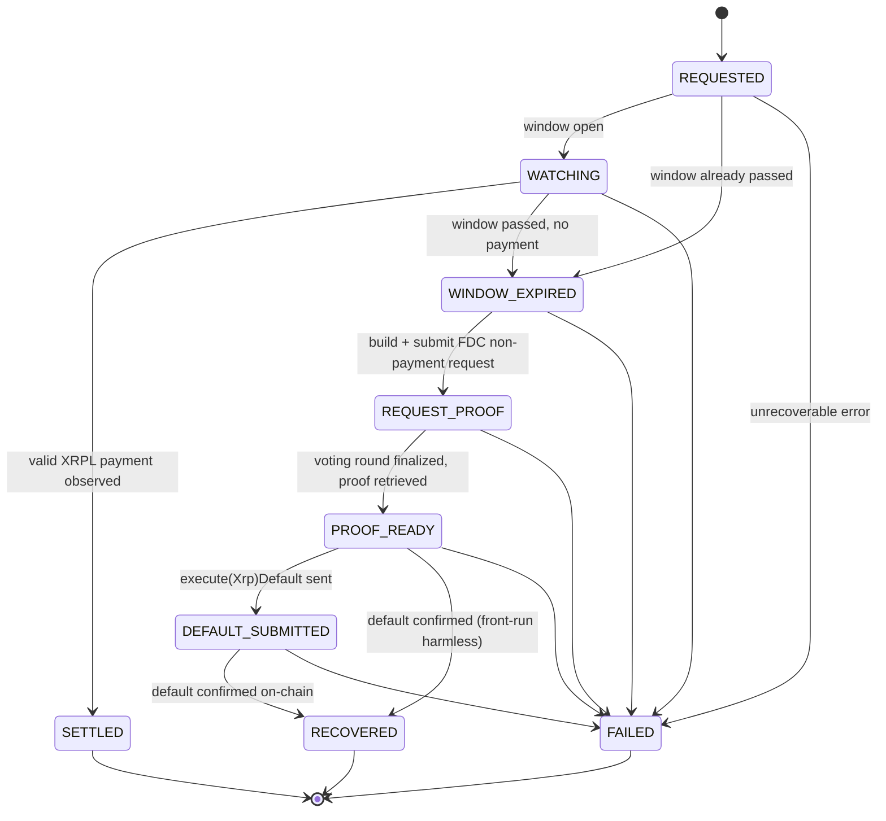

| Status              | Meaning                                                                                       |
| ------------------- | --------------------------------------------------------------------------------------------- |
| `REQUESTED`         | The redemption was indexed; the keeper has not yet started watching.                          |
| `WATCHING`          | Payment window is open (`now ≤ lastUnderlyingTimestamp`); awaiting the agent's payment.       |
| `SETTLED`           | A validated XRPL settlement receipt matched the request. **Terminal.**                        |
| `WINDOW_EXPIRED`    | The window closed without a valid payment; non-payment proof needed.                          |
| `REQUEST_PROOF`     | An FDC non-payment request was submitted; awaiting round finalization.                        |
| `PROOF_READY`       | The Merkle proof was retrieved and persisted; ready to execute the default.                   |
| `DEFAULT_SUBMITTED` | The default transaction was sent; awaiting on-chain confirmation.                             |
| `RECOVERED`         | The default was confirmed; the AssetManager released the redeemer's collateral. **Terminal.** |
| `FAILED`            | An unrecoverable error. **Terminal.**                                                         |

> [!NOTE]
> Front-running the keeper is harmless. Because the executor is permissionless
> and the AssetManager pays the recorded redeemer, whoever lands the default
> first, the redeemer is still made whole — so `PROOF_READY` can transition
> straight to `RECOVERED` if a self-recovery beat the keeper's own submission.

## Getting started

**Prerequisites:** Node.js 22 (or a compatible current LTS),
[pnpm](https://pnpm.io) 10, and — for the contract checks —
[Foundry](https://book.getfoundry.sh) (`forge`).

```bash
pnpm install
cp .env.example .env             # every value has a safe local default

pnpm --filter @harbor/api dev    # build, migrate, and serve the API on :3001
pnpm --filter @harbor/web dev    # start the console on :3000
```

The console runs with no configuration ("mock mode") and targets the API at
`NEXT_PUBLIC_HARBOR_API_URL` (default `http://localhost:3001`).

**Health check:** `GET /health` runs against the SQLite store and returns the
number of applied migrations, the indexer sync cursor, the keeper queue summary,
the last processed FDC round, and build metadata — `200` when healthy and `503`
when the database is unavailable.

Workspace-wide checks:

```bash
pnpm check                   # prettier + per-package checks + forge test
pnpm build                   # build every package in dependency order
pnpm typecheck               # tsc across the workspace
pnpm smoke:protocol-imports  # build shared/protocol, then typecheck api + web
```

> [!NOTE] > `pnpm check:contracts` runs `forge test` and expects Foundry to be installed
> locally; it fails until `forge` is available. The TypeScript packages build
> and test without it.

## Configuration

The backend is a single process whose components are selected with feature
flags, so the API, indexer, XRPL observer, agent refresh, and keeper can each
run on their own. Migrations and the API run by default; everything else is
opt-in.

| Flag                       | Default | Component                                    |
| -------------------------- | ------- | -------------------------------------------- |
| `HARBOR_RUN_MIGRATIONS`    | on      | Apply SQLite migrations at startup.          |
| `HARBOR_RUN_API`           | on      | Serve the read-only HTTP API.                |
| `HARBOR_RUN_INDEXER`       | off     | FAssets event indexer + backfill reconciler. |
| `HARBOR_RUN_XRPL_OBSERVER` | off     | XRPL payment observer.                       |
| `HARBOR_RUN_AGENT_REFRESH` | off     | Agent inventory + reliability score refresh. |
| `HARBOR_RUN_KEEPER`        | off     | Redemption keeper loop.                      |

`HARBOR_API_PORT` (default `3001`) sets the port and `HARBOR_API_CORS_ORIGINS`
configures allowed browser origins (default `http://localhost:3000`). On-chain
components additionally read an RPC endpoint, the `HARBOR_REDEEMER_ADDRESS`, the
keeper key, XRPL and FDC data-availability endpoints, and indexer tuning knobs
(`eth_getLogs` range, poll cadence, start block). The public Coston2 RPC caps
`eth_getLogs` at 30 blocks, which is the indexer's default range.

The frontend reads `NEXT_PUBLIC_*` variables — the API base URL, Coston2 RPC, an
optional WalletConnect project id, the deployed `HarborRedeemer` address, and
the native executor fee (default `0.1 C2FLR`) attached to a redeem when Harbor
is the executor.

Key frontend variables:

| Variable                               | Purpose                           | Default when unset                   |
| -------------------------------------- | --------------------------------- | ------------------------------------ |
| `NEXT_PUBLIC_HARBOR_API_URL`           | Backend base URL                  | `http://localhost:3001`              |
| `NEXT_PUBLIC_RPC_URL_COSTON2`          | Coston2 RPC endpoint              | public Coston2 RPC from the protocol |
| `NEXT_PUBLIC_WALLETCONNECT_PROJECT_ID` | WalletConnect project id          | unset → WalletConnect disabled       |
| `NEXT_PUBLIC_HARBOR_CONTRACT_ADDRESS`  | Deployed `HarborRedeemer` address | unset → executor not nominated       |
| `NEXT_PUBLIC_HARBOR_EXECUTOR_FEE_WEI`  | Executor fee attached to `redeem` | `100000000000000000` (0.1 C2FLR)     |

See [`.env.example`](./.env.example) for the full reference. Chain data and
contract addresses live in one place — [`packages/protocol/src`](./packages/protocol/src) —
so RPC URLs, explorer URLs, registry names, and Coston2 addresses have a single
source of truth that both the backend and the console project from.

## Usage

### Read API

The API is a small, dependency-light HTTP surface built on Node's own `http`
server. It is `GET`-only, answers CORS preflight, tags every response with an
`x-request-id`, serializes money and block heights as exact strings (never JSON
numbers), and returns a uniform error shape:
`{ "error": { "code", "message", "requestId", "details" } }`.

```
GET /health                 process + database + indexer + keeper + FDC status
GET /agents?asset=FXRP      ranked agent statistics (highest score first)
GET /redemptions/:id        a redemption with its evidence-based status timeline
```

Ranked agents come back already sorted, each flagged `scoreIsHeuristic: true`
and joined with any official agent details:

```bash
curl -s "https://api-production-6f3ec.up.railway.app/agents?asset=FXRP" | jq
# {
#   "asset": "FXRP",
#   "scoreIsHeuristic": true,
#   "agents": [
#     {
#       "agentVault": "0x165c…e028",
#       "score": 100, "formulaVersion": "agent-reliability-mvp-v1",
#       "fulfillmentRate": 1, "fulfillmentScore": 45,
#       "settlementTimeScore": 15, "availabilityScore": 20, "collateralScore": 20,
#       "successfulRedemptions": 87, "defaultedRedemptions": 0,
#       "averageSettlementSeconds": 49,
#       "availableLots": "131", "collateralRatioBips": "27723",
#       "collateralRatioSource": "INVENTORY", "ftsoStatus": "AVAILABLE", …
#     }
#   ],
#   "generatedAt": "…"
# }
```

A redemption bundles the request (with its `redemptionKind` and `destinationTag`
and the protocol-assigned agent's official details), an ordered status timeline,
and the underlying evidence (XRPL receipts, FDC requests, and proofs):

```bash
curl -s "https://api-production-6f3ec.up.railway.app/redemptions/38217645" | jq
# {
#   "redemption": { "requestId": "38217645", "status": "SETTLED",
#                   "redemptionKind": "STANDARD", "destinationTag": null,
#                   "agentVault": "0x…", "agentDetails": { "name": null, "iconUrl": null, … },
#                   "paymentAddress": "rsEz74…", "valueUBA": "42500000", "feeUBA": "…", … },
#   "statusTimeline": [
#     { "status": "REQUESTED", "source": "REDEMPTION", … },
#     { "status": "SETTLED",   "source": "XRPL_OBSERVATION", … }
#   ],
#   "xrplReceipts": [ { "transactionHash": "0x5b24…", "deliveredAmountUBA": "42500000", "destinationTag": null, … } ],
#   "fdcRequests": [], "fdcProofs": [], "defaultTransactionHash": null
# }
```

Timeline entries carry a `source` of `REDEMPTION`, `XRPL_OBSERVATION`,
`FDC_REQUEST`, `FDC_PROOF`, or `KEEPER`, so every step is traceable to concrete
evidence rather than an inferred state path.

### Redeem flow

From the redemption console you burn FXRP for underlying XRP: enter an amount of
FXRP (any amount — decimals are supported via `redeemAmount`), an XRPL
destination address, and — only if your destination requires one — an XRPL
**destination tag**. **You do not choose an agent.** FAssets processes
redemptions FIFO: it selects one or more redemption tickets from the front of
the queue and assigns the backing agent(s) automatically, so there is no
"preferred agent" step. The flow approves the AssetManager for the exact amount
and submits the redemption with the Harbor executor nominated
(`redeemAmount` when no tag, `redeemWithTag` when a tag is present), then hands
off to the live status view. That view polls `GET /redemptions/:id` until the
request reaches a terminal state and renders the timeline, the protocol-assigned
agent, the XRPL settlement receipt, and — when a default was needed — the
recovery detail.

The happy path — from a submitted redemption to on-chain settlement:

[](https://harbor-web-olive.vercel.app)

<p align="center"><em>After approving the AssetManager and calling <code>redeemAmount</code>, the emitted request id (<code>38217645</code>) is parsed and the console hands off to the live status view — no agent was ever chosen.</em></p>

[](https://harbor-web-olive.vercel.app/status/38217645)

<p align="center"><em>The FIFO-assigned agent paid on the XRP Ledger, so the request settled: the evidence-based timeline completes and a settlement receipt records the delivered FXRP.</em></p>

The redeem-by-tag lane — for XRPL destinations that require a destination tag
(exchanges, custodials). An optional tag input routes to `redeemWithTag`; the
agent's XRPL payment must carry that exact `DestinationTag` to settle.

[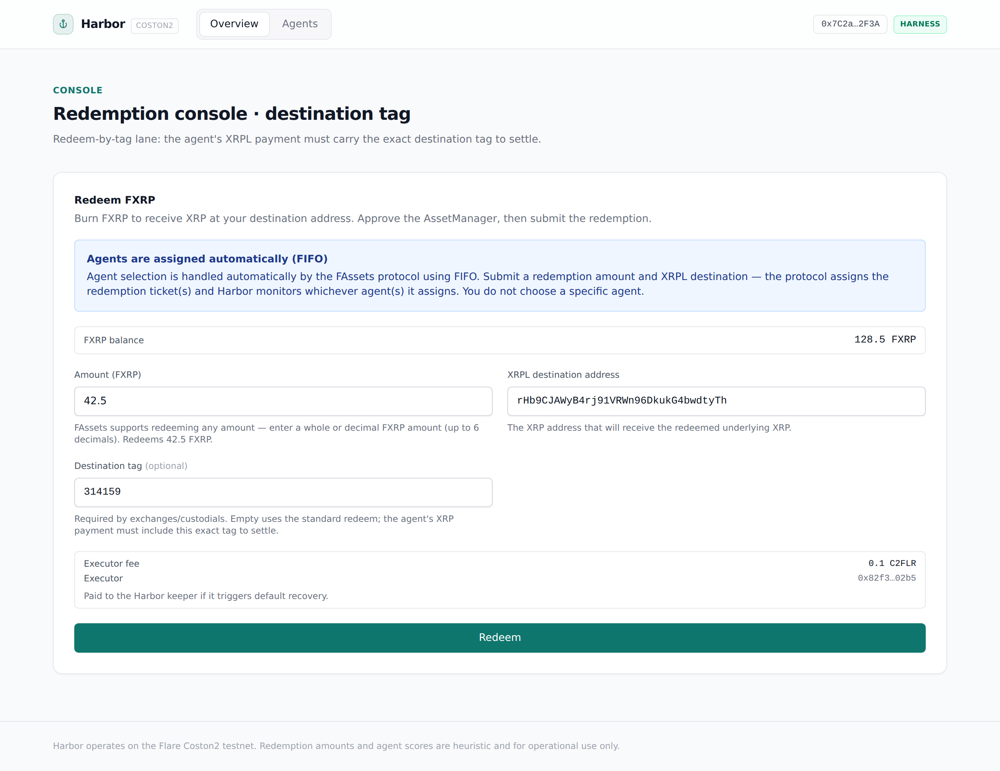](https://harbor-web-olive.vercel.app)

<p align="center"><em>Entering a destination tag selects the <code>redeemWithTag</code> lane; an empty tag keeps the standard <code>redeemAmount</code> path.</em></p>

[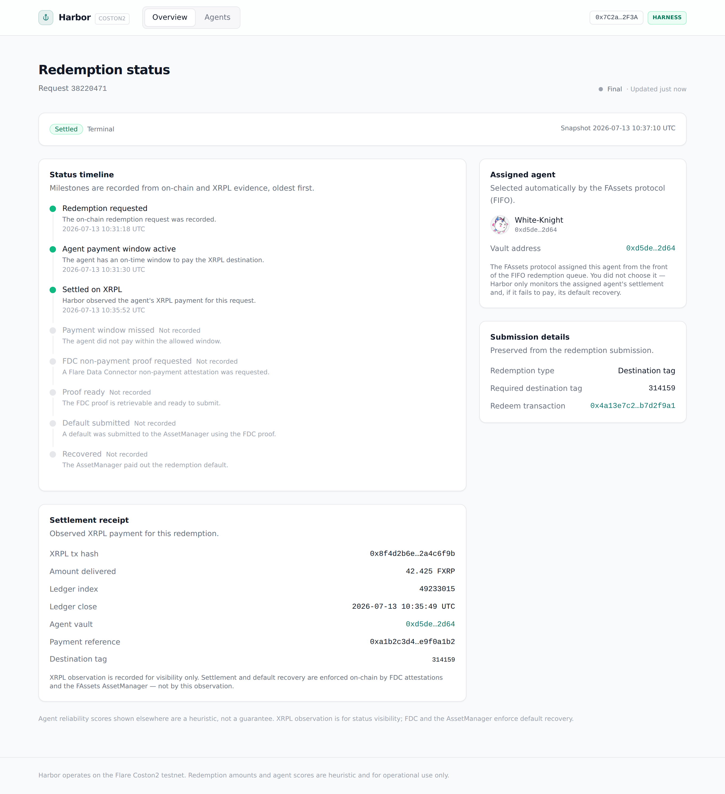](https://harbor-web-olive.vercel.app/status/38220471)

<p align="center"><em>A <code>WITH_TAG</code> redemption settles when the observed XRPL payment matches the destination, net amount, <em>and</em> required destination tag — shown in both the settlement receipt and the submission details.</em></p>

[](https://harbor-web-olive.vercel.app/agents)

The `/agents` page is **informational analytics only**. It surfaces observed
agent reliability — official identity, fulfillment, settlement speed,
availability, collateral, and a transparent heuristic score — to help you
understand network behavior. It does **not** select, prefer, or influence which
agent fulfills a redemption; that is always the protocol's FIFO assignment.

## Build on Harbor

Harbor's read API is public, `GET`-only, and non-custodial, so any wallet,
explorer, or protocol can surface **agent reliability** and **settlement status**
without integrating a contract, holding a key, or asking a user to sign anything.
It is the same data the Harbor console renders, exposed for reuse:

- `GET /agents?asset=FXRP` — the ranked, heuristic agent-reliability leaderboard
  (official identity, fulfillment, settlement speed, availability, collateral).
- `GET /redemptions/:id` — a single redemption's evidence-based status timeline.

Live base URL: `https://api-production-6f3ec.up.railway.app`. Responses send
permissive CORS headers, so a browser on any origin can read them. The data is
informational only and never affects the protocol's FIFO agent assignment.

### Drop-in integrations

| Artifact | Use it for |
| -------- | ---------- |
| [`integration/INTEGRATION.md`](./integration/INTEGRATION.md) | Endpoint reference, field definitions, `curl`/`fetch` examples, and CORS notes. |
| [`integration/harbor-widget.html`](./integration/harbor-widget.html) | A single, dependency-free embeddable widget that renders the FXRP reliability leaderboard. Copy the mount node + `<script>`, or `<iframe src>` it. |
| [`integration/HarborAgentReliability.tsx`](./integration/HarborAgentReliability.tsx) | The same leaderboard as a zero-dependency React component. |

Both the widget and the component are configurable (API base URL, asset, row
limit) and read only public data, so either one drops into an existing product
and shows live Coston2 agent reliability with no backend work.

## Implementation notes

### HarborRedeemer — the permissionless executor

`HarborRedeemer` is a small `Ownable`, `ReentrancyGuard` contract that resolves
the FXRP `AssetManager` (from the Flare contract registry or a direct address)
and its FAsset token at construction. It exposes **two** external default
actions, both permissionless and self-funding for whoever submits the
transaction:

- `executeDefault(IReferencedPaymentNonexistence.Proof, requestId)` forwards to
  `AssetManager.redemptionPaymentDefault` — the **standard** lane.
- `executeXrpDefault(IXRPPaymentNonexistence.Proof, requestId)` forwards to
  `AssetManager.xrpRedemptionPaymentDefault` — the **redeem-by-tag** lane.

Each measures any native executor fee it receives and forwards it to
`msg.sender`. A `WITH_TAG` redemption can only be defaulted through
`executeXrpDefault`; the standard proof type does not apply — the two lanes are
strictly isolated. The contract deliberately does **not** wrap `redeem`: FAssets
records the redemption caller as the redeemer and pays default collateral to
that recorded redeemer, so wrapping `redeem` would make Harbor the beneficiary.
Its `receive()` only accepts native value from the AssetManager, rejecting stray
transfers, and the owner can rotate the default keeper executor.

### The settlement keeper

The keeper is a deterministic state machine evaluated per redemption (see
[The settlement keeper](#the-settlement-keeper)). While the payment window is
open (`now ≤ lastUnderlyingTimestamp`) the request stays `WATCHING`; a validated
XRPL receipt settles it. Once the window passes, the keeper marks it
`WINDOW_EXPIRED` and, in the same pass, builds or reuses an FDC non-payment
request, submits it, waits for its voting round to finalize, retrieves the
proof, and — at `PROOF_READY` — calls the correct default entrypoint before
moving to `DEFAULT_SUBMITTED`. Lane selection is delegated to the default
executor by `redemptionKind`, so the state machine itself is kind-agnostic.

[](https://harbor-web-olive.vercel.app/status/38216902)

<p align="center"><em>The edge case: the FIFO-assigned agent missed its payment window, so the keeper drove the FDC non-payment proof to <code>PROOF_READY</code>. The permissionless self-recovery panel can submit the default from any wallet.</em></p>

### FDC non-payment proofs

Non-payment is proven with the Flare Data Connector. The pipeline builds,
submits, finalizes, and retrieves proofs over the `testXRP` source, choosing the
attestation type by lane:

- **Standard** — `ReferencedPaymentNonexistence`. The request body encodes the
  destination-address hash, amount, the standard payment reference, and the
  request's underlying block/time deadlines.
- **Redeem-by-tag** — `XRPPaymentNonexistence` (XRP-native). The request body
  encodes the destination-address hash, net amount, a first-memo-data check and
  hash, a **destination-tag check and the tag itself**, and the deadlines.

The backend submits the request to the `FdcHub`, tracks the voting round to
finalization, then fetches the response and Merkle proof from the
data-availability layer. The decoded response tuple uses the protocol's
canonical ABI, so the calldata the keeper assembles and the calldata the UI
decodes for self-recovery are byte-for-byte the same shape the verifier expects.
A `WITH_TAG` redemption is defaulted via `executeXrpDefault`; a standard
redemption via `executeDefault`. The two lanes are strictly isolated by
`redemptionKind`.

### XRPL settlement observer

The observer polls the agent's XRPL underlying address and validates each
payment against the redemption: the destination must match the redemption's
payment address, the standard payment reference must match, the delivered amount
must be at least the redemption value **net of the agent's fee**
(`netUnderlyingUBA = valueUBA − feeUBA`), and the ledger index and close time
must fall inside the request's underlying window. For a `WITH_TAG` redemption
the observed `DestinationTag` must additionally equal the required tag exactly
(standard redemptions ignore the observed tag). A payment that passes is written
as a settlement receipt, giving a fast, XRPL-sourced settlement signal that does
not wait on the on-chain `RedemptionPerformed` event.

> [!WARNING]
> The net-amount check is critical. `netUnderlyingUBA` is the **single source of
> truth** shared by the observer and the keeper, so they can never drift.
> Comparing a delivered payment against the gross `valueUBA` would misclassify
> every redemption with a non-zero fee as non-payment and risk a wrongful
> default.

### Agent reliability scoring

The score (`agent-reliability-mvp-v1`) is a transparent sum a reader can follow
term by term, clamped to `[0, 100]`:

```
fulfillment      (≤ 45)  = fulfillment_rate · 45         (22.5 with no history yet)
settlement_time  (≤ 15)  from average settlement seconds (fast ≤ 1h, slow ≥ 24h)
availability     (≤ 20)  from published availability + free lots
collateral       (≤ 20)  from the agent's collateral ratio (floor 120% … full 200%)
default_penalty  (≤ 20)  = min(defaults · 5, 20)          (subtracted)
```

Collateral ratios are read from indexed inventory when present and otherwise
derived from live FTSOv2 `XRP/USD` and `FLR/USD` feeds, with the feed freshness
carried through as an `ftsoStatus`. The result is always served with
`scoreIsHeuristic: true`: it ranks agents for operational comparison and is
never a promise of settlement, and never affects the protocol's FIFO assignment.

### Official agent details

The indexer reads each agent's published metadata from the FAssets
`AgentOwnerRegistry` (`getAgentName`, `getAgentDescription`, `getAgentIconUrl`,
`getAgentTermsOfUseUrl`), keyed by the owner's management address, and stores it
alongside inventory. The API joins these details onto the agent statistics and
onto the protocol-assigned agent on a redemption's status. Every field is
independently optional: a missing value normalizes to `null`, and consumers fall
back to the vault address — so the identity layer never changes functional
behavior, only presentation.

### Durable FAssets indexing

The indexer watches the AssetManager's redemption events (`RedemptionRequested`,
`RedemptionWithTagRequested`, `RedemptionPerformed`, `RedemptionDefault`,
`RedemptionAmountIncomplete`, and the ticket events) alongside `HarborRedeemer`
events. A `RedemptionWithTagRequested` event upserts a tracked `WITH_TAG`
redemption; a `RedemptionRequested` event a `STANDARD` one. A low-latency live
watch runs beside a backfill reconciler that advances a persisted cursor on a
poll loop, so events emitted during a restart, redeploy, or RPC gap are
recovered rather than dropped — the fix that keeps a redemption's status from
freezing mid-flight.

> [!NOTE]
> Lane persistence is downgrade-proof. A `WITH_TAG` redemption is "sticky": a
> later status-carrying upsert (which defaults the kind to `STANDARD` when
> omitted) can never silently downgrade the lane and misroute its default. A
> corrupt lane value fails loudly on read rather than misrouting.

### Self-recovery in the UI

Because both default entrypoints are permissionless, the console can complete a
default itself. The self-recovery panel takes the already-prepared FDC proof
from `GET /redemptions/:id`, decodes the response with the protocol's canonical
ABI (`ReferencedPaymentNonexistence` for standard, `XRPPaymentNonexistence` for
tag), assembles the exact `executeDefault` / `executeXrpDefault` arguments by
`redemptionKind`, and submits them from the connected wallet — mirroring how the
backend keeper builds the same calldata, so the UI never fabricates or accepts
arbitrary proof data.

[](https://harbor-web-olive.vercel.app/status/38216902)

<p align="center"><em>Submitting the default with the proof drives the request to <code>RECOVERED</code> — the AssetManager releases the redeemer's collateral. Front-running is harmless: whoever lands the default first, the redeemer is still made whole.</em></p>

## Data model

State is persisted in SQLite through a small set of forward-only migrations
(`services/api/src/db/migrations`). Money and block heights are stored and
served as exact strings; bigints are serialized deterministically, never as JSON
numbers.

| Migration | Adds                                                                                     |
| --------- | ---------------------------------------------------------------------------------------- |
| `0001`    | Initial schema — redemptions, agents, sync cursors, keeper jobs.                         |
| `0002`    | Agent inventory fields (availability, fees, free lots, collateral).                      |
| `0003`    | Agent reliability score records (term-by-term breakdown + formula version).              |
| `0004`    | XRPL observation receipts.                                                               |
| `0005`    | FDC request `PROOF_READY` status.                                                        |
| `0006`    | Official agent-details fields (name, description, icon URL, terms-of-use URL).           |
| `0007`    | Redeem-by-tag: `redemptions.redemption_kind` (+ `destination_tag`) and observation tags. |

## On-chain deployment

Flare **Coston2** testnet (`chainId 114`), native currency `C2FLR`, RPC
`https://coston2-api.flare.network/ext/C/rpc`, Blockscout explorer
`https://coston2-explorer.flare.network`. The FXRP FAsset is `FTestXRP`
(6 decimals), with a lot size of `10_000_000` UBA.

| Contract                 | Address                                                                                                                                   |
| ------------------------ | ----------------------------------------------------------------------------------------------------------------------------------------- |
| HarborRedeemer           | [`0x82f39361FFb1a438e4EBF8025efa06e4511b02b5`](https://coston2-explorer.flare.network/address/0x82f39361FFb1a438e4EBF8025efa06e4511b02b5) |
| FXRP AssetManager        | [`0xc1Ca88b937d0b528842F95d5731ffB586f4fbDFA`](https://coston2-explorer.flare.network/address/0xc1Ca88b937d0b528842F95d5731ffB586f4fbDFA) |
| FXRP FAsset (`FTestXRP`) | [`0x0b6A3645c240605887a5532109323A3E12273dc7`](https://coston2-explorer.flare.network/address/0x0b6A3645c240605887a5532109323A3E12273dc7) |
| FDC Hub                  | [`0x48aC463d7975828989331F4De43341627b9c5f1D`](https://coston2-explorer.flare.network/address/0x48aC463d7975828989331F4De43341627b9c5f1D) |
| FDC Verification         | [`0x906507E0B64bcD494Db73bd0459d1C667e14B933`](https://coston2-explorer.flare.network/address/0x906507E0B64bcD494Db73bd0459d1C667e14B933) |
| Relay                    | [`0xa10B672D1c62e5457b17af63d4302add6A99d7dE`](https://coston2-explorer.flare.network/address/0xa10B672D1c62e5457b17af63d4302add6A99d7dE) |
| FTSOv2                   | [`0xC4e9c78EA53db782E28f28Fdf80BaF59336B304d`](https://coston2-explorer.flare.network/address/0xC4e9c78EA53db782E28f28Fdf80BaF59336B304d) |
| Flare Contract Registry  | [`0xaD67FE66660Fb8dFE9d6b1b4240d8650e30F6019`](https://coston2-explorer.flare.network/address/0xaD67FE66660Fb8dFE9d6b1b4240d8650e30F6019) |

The deploy script
[`contracts/script/DeployHarborRedeemer.s.sol`](./contracts/script/DeployHarborRedeemer.s.sol)
defaults to the Coston2 registry and resolves `AssetManagerFXRP` through it.

```bash
# Dry-run against Coston2 without a private key
RPC_URL_COSTON2=https://coston2-api.flare.network/ext/C/rpc \
  pnpm deploy:harbor:coston2:dry-run

# Broadcast (only after funding the deployer)
RPC_URL_COSTON2=https://coston2-api.flare.network/ext/C/rpc \
DEPLOYER_PRIVATE_KEY=… \
KEEPER_EXECUTOR_ADDRESS=… \
  pnpm deploy:harbor:coston2
```

After deploying, regenerate the typed ABI with `pnpm protocol:generate-harbor-abi`
so downstream packages import `harborRedeemerAbi`, `HARBOR_REDEEMER_ADDRESS`, and
`harborRedeemerAddress` from `@harbor/protocol`, then set the address in your
backend (`HARBOR_REDEEMER_ADDRESS`) and frontend
(`NEXT_PUBLIC_HARBOR_CONTRACT_ADDRESS`) environments.

**Runtime services (production).** The console is deployed on Vercel and the
backend on Railway (see the links at the top). The backend runs the API by
default; enable the indexer, XRPL observer, agent refresh, and keeper via the
feature flags in [Configuration](#configuration), each with the on-chain
endpoints and keys it needs.

> [!WARNING]
> These scripts are for Coston2 only. Do not use them for mainnet, Songbird, or
> production hosting.

## Development

```bash
pnpm build | typecheck | lint | format   # workspace-wide
pnpm check                                # format + package checks + forge test
pnpm --filter @harbor/api dev             # build, migrate, and run the service
pnpm --filter @harbor/api keeper:once     # run one keeper pass
pnpm --filter @harbor/api agents:score:refresh   # recompute reliability scores
pnpm --filter @harbor/web dev | build | test | test:e2e
```

A few conventions worth knowing before contributing:

- **One source of truth for protocol data.** Chain ids, addresses, and ABIs live
  in `@harbor/protocol`; the backend and console project from it rather than
  hardcoding.
- **Money and block heights are strings.** Values cross the wire as exact decimal
  strings; bigints are serialized deterministically, never as JSON numbers.
- **Evidence over inference.** Status timelines are assembled from stored
  receipts, requests, and proofs, not from a guessed state path.
- **Lanes are isolated by `redemptionKind`.** A kind/proof mismatch is rejected
  before any transaction; `WITH_TAG` persistence is monotonic and never
  downgrades.
- **Scores are heuristics.** Reliability is always surfaced with
  `scoreIsHeuristic: true` and never gates settlement or agent assignment.

## Testing

Tests are split by cost, so the fast suites run without any external service and
the on-chain suites gate on the relevant environment variables. Both redemption
lanes are covered end to end — from Solidity units and fuzz/invariants, through
backend proof/settlement logic, to web unit, component, and Playwright specs.

| Suite                         | Files | Scope                                                                         |
| ----------------------------- | ----: | ----------------------------------------------------------------------------- |
| Contracts (Foundry)           |     3 | `HarborRedeemer` unit (standard + XRP default) + invariants + deploy script.  |
| API (`node:test`)             |    16 | server, repositories, keeper, FDC (standard + XRP), indexer, XRPL, scoring.   |
| Web unit / component (Vitest) |    19 | lib logic + component behaviour against a mocked API.                         |
| Web end-to-end (Playwright)   |     7 | redeem (any amount + tag), no-agent-selection, status, agents, self-recovery. |
| Shared                        |     2 | domain (kinds, destination tags), env, JSON, normalization helpers.           |
| Protocol                      |     3 | ABIs (incl. XRP attestation tuples), addresses, and the generated artifact.   |

Beyond the in-repo suites, [`test/e2e`](./test/e2e) contains **live Coston2**
end-to-end runners for both lanes (`harbor-e2e.ts` and `harbor-tag-e2e.ts`).
They exercise the real redeem → settle and redeem → default → recover
lifecycles against deployed contracts, confirm `redeemWithTagSupported()` and
the on-chain `executeXrpDefault` wiring, and degrade gracefully (never faking a
pass) when FXRP or FDC egress is unavailable.

### Codebase at a glance

Approximate size by area, excluding vendored dependencies and build output
(measured as raw line counts — blank and comment lines included).

| Area                                         | Files |   Lines |
| -------------------------------------------- | ----: | ------: |
| TypeScript — application & library           |  ~130 | ~24,600 |
| TypeScript — tests                           |   ~47 | ~16,900 |
| Smart contracts — Solidity (`src`, `script`) |     2 |     235 |
| Solidity — tests                             |     7 |   1,616 |
| SQL migrations (embedded in TypeScript)      |     7 |       — |

The workspace runs on a strict TypeScript base (`noUncheckedIndexedAccess`,
`exactOptionalPropertyTypes`) with the on-chain contract surface kept
intentionally tiny.

## Roadmap

Documented but intentionally out of scope for this testnet MVP:

- Mainnet and Songbird deployment with production hardening (the current tooling
  is Coston2-only by design).
- Additional FAssets beyond FXRP.
- Backtested and versioned reliability scoring beyond the transparent MVP
  heuristic.

## Documentation

| Area               | Reference                                                                                                                       |
| ------------------ | ------------------------------------------------------------------------------------------------------------------------------- |
| Web console        | [`apps/web/README.md`](./apps/web/README.md)                                                                                    |
| Smart contract     | [`contracts/src/HarborRedeemer.sol`](./contracts/src/HarborRedeemer.sol) · [`contracts/foundry.toml`](./contracts/foundry.toml) |
| Configuration      | [`.env.example`](./.env.example)                                                                                                |
| Protocol constants | [`packages/protocol/src`](./packages/protocol/src) — chains, addresses, ABIs                                                    |
| Backend modules    | [`services/api/src`](./services/api/src) — api · indexer · keeper · fdc · xrpl · scoring                                        |
| Live e2e           | [`test/e2e/README.md`](./test/e2e/README.md) — standard + redeem-by-tag Coston2 runners                                         |
| Build on Harbor    | [`integration/INTEGRATION.md`](./integration/INTEGRATION.md) — read-API guide · [`integration/harbor-widget.html`](./integration/harbor-widget.html) · [`integration/HarborAgentReliability.tsx`](./integration/HarborAgentReliability.tsx) |

## Contributing

This is a personal portfolio project, so it is not looking for feature
contributions. Bug reports and correctness fixes are welcome — open an issue or a
focused pull request, keep the settlement and proof logic deterministic, keep
the two redemption lanes isolated by `redemptionKind`, and add or update the test
that pins the behaviour you touch.

## License

Licensed under the Apache License, Version 2.0. See [`LICENSE`](./LICENSE) for
the full text.
