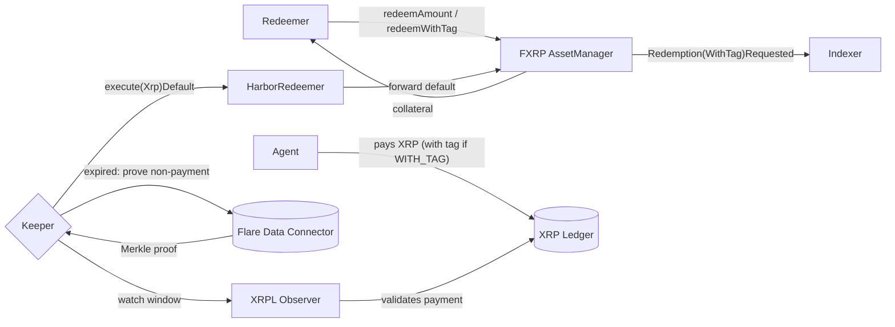
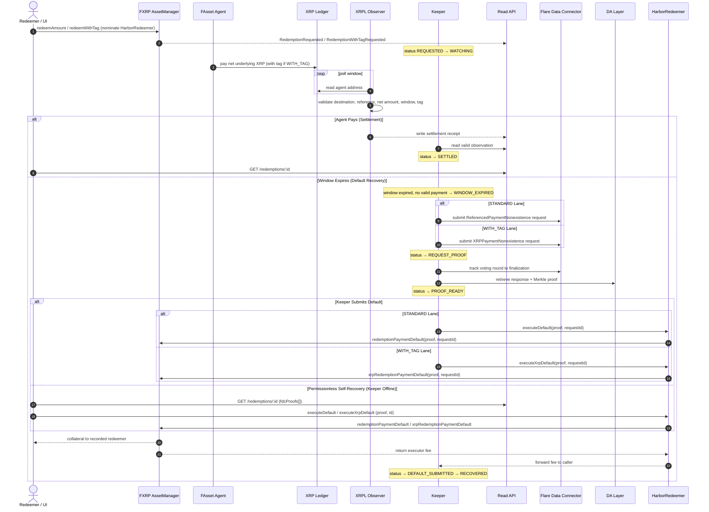
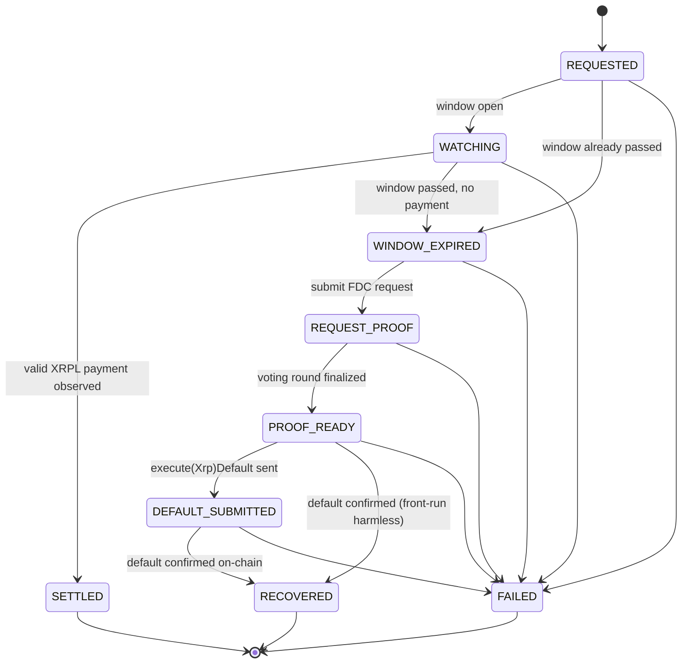

# Harbor

> **A guaranteed-settlement layer for FXRP redemptions on Flare — now with a destination-tag redemption lane.**

> 🏆 **Built for the [Flare Summer Signal](https://dorahacks.io/hackathon/flaresummersignal) hackathon.**
> Project submission (BUIDL): **[dorahacks.io/buidl/46944](https://dorahacks.io/buidl/46944)**.

[](LICENSE)


Harbor sits between an FXRP redeemer and the agent that owes them XRP, ensuring that missed payments automatically trigger FAssets default recovery. Because it never custodies funds, recovered collateral is always paid directly to you.

|             |                                                                                            |
| ----------- | ------------------------------------------------------------------------------------------ |
| Live demo   | [harbor-web-olive.vercel.app](https://harbor-web-olive.vercel.app)                         |
| Backend API | [api-production-6f3ec.up.railway.app](https://api-production-6f3ec.up.railway.app)         |
| Walkthrough | ▶ [Watch the new demo video on YouTube](https://www.youtube.com/watch?v=TABAwMhMG20)       |

[](https://www.youtube.com/watch?v=TABAwMhMG20)

<p align="center"><em>▶ <a href="https://www.youtube.com/watch?v=TABAwMhMG20">Watch the demo video</a> — redeem → watch XRPL → settle, or prove non-payment → execute default → recover collateral.</em></p>

*Note: High-res video assets are also available in the repository at `assets/loom/video.mp4` (90-second walkthrough) and `assets/demo/harbor-demo.mp4` (2-minute product demo).*

## Features

- **Non-custodial by construction:** Harbor acts as the nominated executor. You redeem directly on the `AssetManager`, so default collateral is paid to you.
- **Two Redemption Lanes:**
  - **Standard (`redeemAmount`):** Uses the `ReferencedPaymentNonexistence` proof and `HarborRedeemer.executeDefault`.
  - **Redeem-by-tag (`redeemWithTag`):** For XRPL destinations requiring a tag. Uses the XRP-native `XRPPaymentNonexistence` proof and `HarborRedeemer.executeXrpDefault`. (Tag `0` is valid; an empty input uses the standard lane. Automatically disabled if `redeemWithTagSupported()` is false).
- **No agent selection:** FAssets handles agent assignment via FIFO.
- **Permissionless self-recovery:** Anyone can complete a stuck default directly from the UI using the pre-built FDC proof bytes.
- **Heuristic reliability scoring:** Ranks agents (`agent-reliability-mvp-v1`) based on fulfillment, speed, availability, and FTSOv2 collateral ratios. Purely informational analytics.
- **Fast XRPL settlement observer:** Validates `netUnderlyingUBA` (`valueUBA - feeUBA`) and destination tags directly from the ledger.
- **Durable indexing:** FAssets indexer recovers events across RPC gaps via a persisted cursor.
- **Zero-config local dev:** Everything boots in "mock mode" with local defaults.

## Architecture & Lifecycle

Harbor is a Next.js 14 / Node.js 22 pnpm monorepo. The core system operates on the Flare Coston2 testnet.



### Comprehensive Sequence (Settlement & Recovery)



### Keeper State Machine

The keeper evaluates requests deterministically. Front-running it via self-recovery is harmless.



## Agent Reliability Scoring

Formula (`agent-reliability-mvp-v1`) clamped to `[0, 100]`:
```text
fulfillment      (≤ 45)  = fulfillment_rate · 45 (22.5 if no history)
settlement_time  (≤ 15)  = based on average settlement seconds (fast ≤ 1h, slow ≥ 24h)
availability     (≤ 20)  = from published availability + free lots
collateral       (≤ 20)  = from agent's collateral ratio (floor 120% ... full 200%)
default_penalty  (≤ 20)  = min(defaults · 5, 20) (subtracted)
```
Scores are heuristic and **never** influence the protocol's FIFO agent assignment. Identity data (name, icon) is parsed directly from `AgentOwnerRegistry`.

## Build on Harbor

Public, `GET`-only API providing read-only access to reliability and settlement status:
- `GET /agents?asset=FXRP` — Heuristic agent leaderboard
- `GET /redemptions/:id` — Evidence-based timeline

**Drop-in Integrations:**
- `integration/harbor-widget.html`: Zero-dependency embeddable leaderboard.
- `integration/HarborAgentReliability.tsx`: Configurable React component.
- See `integration/INTEGRATION.md` for full field definitions.

## Getting Started (Development)

Requires Node.js 22+, pnpm 10, and Foundry (for contract checks).

```bash
pnpm install
cp .env.example .env

pnpm --filter @harbor/api dev    # Starts API on :3001
pnpm --filter @harbor/web dev    # Starts Next.js console on :3000
pnpm check                       # Format, typecheck, forge test
```

### Component Toggles (Backend)
Configured via `.env` defaults:
- `HARBOR_RUN_API` (on)
- `HARBOR_RUN_MIGRATIONS` (on)
- `HARBOR_RUN_INDEXER`, `HARBOR_RUN_XRPL_OBSERVER`, `HARBOR_RUN_AGENT_REFRESH`, `HARBOR_RUN_KEEPER` (off)

### Tests
- **Foundry (Contracts):** `pnpm check:contracts` (3 suites)
- **API (node:test):** `pnpm test` in `@harbor/api` (16 suites)
- **Web (Vitest):** `pnpm test` in `@harbor/web` (19 suites)
- **E2E (Playwright):** `pnpm test:e2e` in `@harbor/web` (7 suites)
- **Live Coston2 E2E:** Located in `test/e2e` (`harbor-e2e.ts`, `harbor-tag-e2e.ts`)

## On-chain Deployment (Coston2)

`HarborRedeemer` requires Solidity `0.8.25` and exposes a secure `receive()` hook, `executeDefault`, and `executeXrpDefault` to forward the respective proofs and refund fees. It resolves `AssetManagerFXRP` on initialization.

```bash
# Broadcast deployment
RPC_URL_COSTON2=... DEPLOYER_PRIVATE_KEY=... KEEPER_EXECUTOR_ADDRESS=... pnpm deploy:harbor:coston2
# Regen ABIs
pnpm protocol:generate-harbor-abi
```

**Deployed Addresses:**
- HarborRedeemer: `0x82f39361FFb1a438e4EBF8025efa06e4511b02b5`
- FXRP AssetManager: `0xc1Ca88b937d0b528842F95d5731ffB586f4fbDFA`
- FXRP Token (FTestXRP): `0x0b6A3645c240605887a5532109323A3E12273dc7`

## License
Licensed under Apache 2.0.
