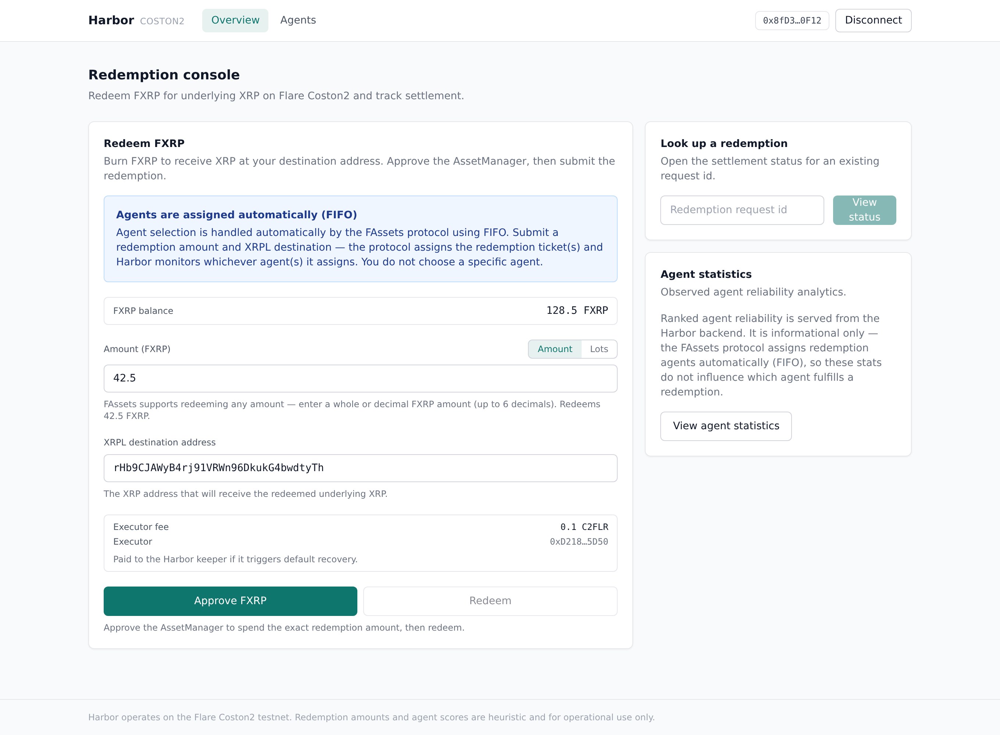
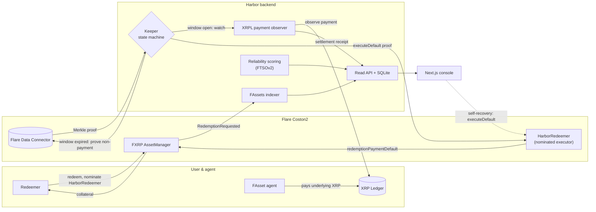
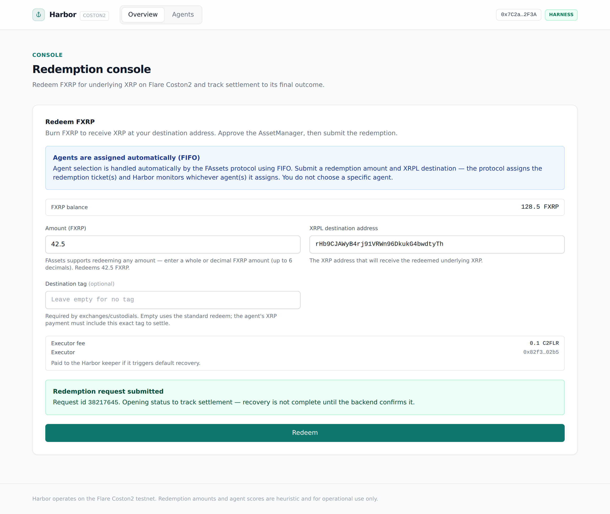
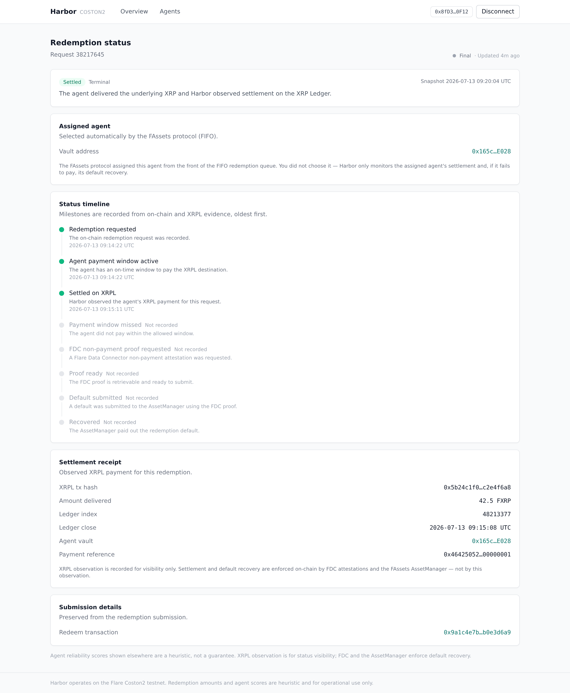
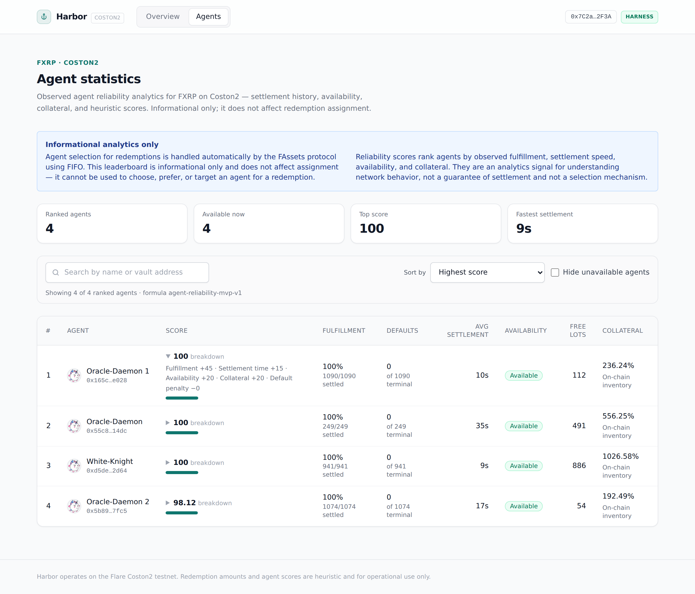
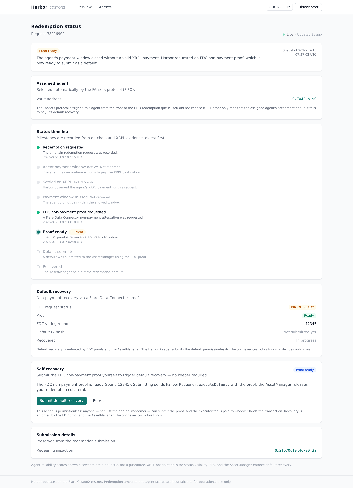
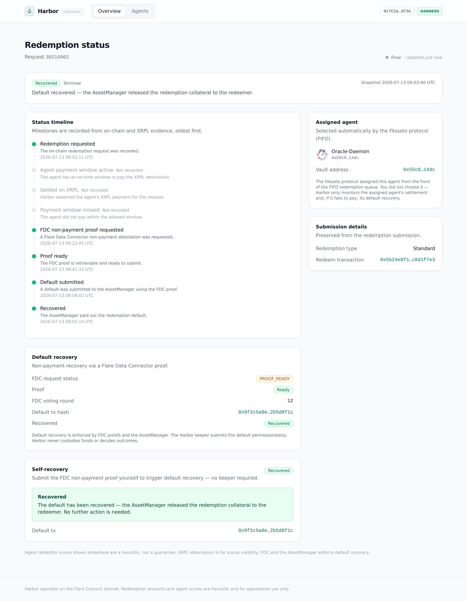

# Harbor

> **A guaranteed-settlement layer for FXRP redemptions on Flare.**

[](LICENSE)


Harbor sits between an FXRP redeemer and the agent that owes them XRP. When you
redeem FXRP on Flare, an agent has a fixed window to deliver the underlying XRP
on the XRP Ledger. If the agent pays, the redemption settles; if the window
lapses, you are owed vault collateral instead — but only if someone notices the
miss, assembles a cryptographic proof of non-payment, and submits the default
on-chain before the request is cleaned up. Most redeemers never do.

Harbor closes that gap without ever custodying funds. Users redeem directly on
the FXRP AssetManager and nominate Harbor's on-chain executor; from there a
keeper watches each request end to end. It confirms the agent's XRPL payment
from the ledger itself, or — when the window expires — builds a Flare Data
Connector proof of non-payment, waits for it to finalize, and triggers the
on-chain default so the redeemer's collateral is recovered automatically. If the
keeper is ever unavailable, anyone can finish a stuck default straight from the
UI, because the executor path is permissionless by design.

Around that core, Harbor indexes live FAssets activity, scores agents on their
observed reliability, and presents the whole lifecycle — redeem, settle, or
recover — through a Next.js console.

The system drives one settlement lifecycle end to end:

> **redeem → watch XRPL → settle · or prove non-payment → execute default → recover collateral**

|             |                                                                                                                         |
| ----------- | ----------------------------------------------------------------------------------------------------------------------- |
| Live demo   | [harbor-web-olive.vercel.app](https://harbor-web-olive.vercel.app)                                                      |
| Backend API | [api-production-6f3ec.up.railway.app](https://api-production-6f3ec.up.railway.app)                                      |
| Walkthrough | ▶ [Watch on YouTube](https://www.youtube.com/watch?v=97Q2v0fn6VI) (2 min) · [4K capture](./assets/demo/harbor-demo.mp4) |

[](https://www.youtube.com/watch?v=97Q2v0fn6VI)

<p align="center"><em>▶ <a href="https://www.youtube.com/watch?v=97Q2v0fn6VI">Watch the 2-minute walkthrough</a> — redeem → watch XRPL → settle, or prove non-payment → execute default → recover collateral.</em></p>

---

## Table of contents

- [Project status](#project-status)
- [Why Harbor](#why-harbor)
- [Features](#features)
- [Architecture](#architecture)
- [Repository layout](#repository-layout)
- [Getting started](#getting-started)
- [Configuration](#configuration)
- [Usage](#usage)
- [Implementation notes](#implementation-notes)
- [On-chain deployment](#on-chain-deployment)
- [Development](#development)
- [Roadmap](#roadmap)
- [Documentation](#documentation)
- [Contributing](#contributing)
- [License](#license)

---

## Project status

Harbor is maintained as a portfolio project and runs entirely on the Flare
**Coston2** testnet. It is a working MVP rather than a product: the
`HarborRedeemer` contract is deployed on Coston2, the backend indexes and settles
live redemptions, and the console is public for review. It is deliberately scoped
to testnet — the deployment tooling refuses mainnet, Songbird, and production
targets, and agent reliability scores are explicit heuristics, never a settlement
guarantee.

The repository is kept as a reference implementation: the code, the on-chain
deployment, and the live demo remain available, and changes land at a maintenance
pace.

## Why Harbor

The FAssets redemption default is a real protection, but a manual one. A redeemer
who is owed XRP and does not receive it has to monitor the agent's XRPL address,
detect that the payment window closed without a valid payment, request a Flare
Data Connector `ReferencedPaymentNonexistence` attestation, wait for its voting
round to finalize, retrieve the Merkle proof from the data-availability layer,
and only then call `redemptionPaymentDefault` with that proof — correctly, and
before the request is gone. Every step is easy to miss and easy to get wrong, so
in practice the guarantee often goes unclaimed.

Harbor turns that manual burden into infrastructure without inserting itself into
custody. Three cooperating parts enforce it:

1. **A permissionless on-chain executor** — `HarborRedeemer` is nominated as the
   redemption executor and exposes a single `executeDefault(proof, requestId)`
   entry point that anyone can call. It forwards to the AssetManager and returns
   the executor fee to whoever submitted the transaction.
2. **A settlement keeper** — a deterministic per-redemption state machine that
   watches the payment window, confirms XRPL settlement, and otherwise drives the
   full non-payment proof and default flow to completion.
3. **A reliability layer** — an indexer, a heuristic agent score, and a read API
   that surface observed agent reliability as informational network analytics
   and let a redeemer follow a request's settlement. This is analytics only: the
   protocol assigns redemption agents FIFO, so nothing here selects or influences
   which agent fulfills a redemption.

Because Harbor never holds the FAsset or the redeemer role — FAssets pays default
collateral to the recorded redeemer, so Harbor intentionally never wraps
`redeem` — recovered collateral always goes to the user, and the worst case if
Harbor disappears is that a redeemer submits `executeDefault` themselves.

## Features

- **Non-custodial by construction.** Harbor never wraps `redeem` and never holds
  the FAsset. Users redeem on the AssetManager directly and nominate the Harbor
  executor, so default collateral is always paid to them.
- **Automatic default recovery.** The keeper detects a missed payment window,
  proves non-payment through the FDC, and submits the on-chain default without any
  action from the redeemer.
- **Permissionless self-recovery.** Every default is submittable by anyone. The
  console can decode the prepared FDC proof and call `executeDefault` from a
  connected wallet, so a stuck request is never stranded on the keeper.
- **Proof-carrying, not trust-carrying.** Defaults are only ever executed against
  a finalized FDC `ReferencedPaymentNonexistence` proof; the UI reuses the exact
  proof bytes the backend assembled and never accepts hand-supplied JSON.
- **Evidence-based status timeline.** A request's timeline is built from concrete
  stored evidence — the on-chain request, XRPL settlement receipts, FDC requests
  and proofs, and the submitted default — not from an inferred state path.
- **Fast XRPL settlement signal.** An optional observer polls the agent's XRPL
  address and records a validated settlement receipt the moment the payment lands,
  independent of the on-chain event stream.
- **Heuristic agent reliability.** A transparent, term-by-term score ranks agents
  on fulfillment, settlement speed, availability, and collateral — the collateral
  ratio derived from live FTSOv2 prices — and is always flagged as a heuristic.
- **Durable indexing.** The FAssets indexer backfills from a persisted cursor on a
  poll loop, so events emitted during a restart, redeploy, or RPC gap are
  recovered instead of lost.
- **Redeem-by-tag (destination tags).** The console supports FXRP redemptions
  that require an XRPL destination tag (exchanges and custodials). An optional
  tag input routes to `AssetManager.redeemWithTag`; the agent's XRPL payment
  must carry that exact `DestinationTag` to settle, and a missed payment is
  defaulted through the XRP-native FDC `XRPPaymentNonexistence` proof and the
  permissionless `HarborRedeemer.executeXrpDefault` entrypoint — the tag-lane
  mirror of the standard non-payment default. Tag `0` is a valid tag; an empty
  input means the standard `redeemAmount` path.
- **Runs with zero configuration.** Every service flag and every `NEXT_PUBLIC_*`
  value has a safe local default, so the API and console boot in "mock mode" with
  no secrets.

## Architecture

The pipeline is a single settlement lifecycle with one on-chain crossing point.
Everything the redeemer touches happens on the AssetManager; everything Harbor
adds is off-chain automation that only ever calls the permissionless executor.



Each stage is an isolated module with a narrow contract:

| Stage         | Module                                                                   | Responsibility                                                                              |
| ------------- | ------------------------------------------------------------------------ | ------------------------------------------------------------------------------------------- |
| Executor      | [`contracts/src/HarborRedeemer.sol`](./contracts/src/HarborRedeemer.sol) | Permissionless default executor; forwards to the AssetManager and refunds the caller's fee. |
| Indexer       | [`services/api/src/indexer`](./services/api/src/indexer)                 | Durable FAssets event indexer plus agent-inventory reader.                                  |
| XRPL observer | [`services/api/src/xrpl`](./services/api/src/xrpl)                       | Confirms the agent's underlying payment directly from the XRP Ledger.                       |
| Keeper        | [`services/api/src/keeper`](./services/api/src/keeper)                   | Per-redemption state machine: watch → settle, or prove → default.                           |
| FDC           | [`services/api/src/fdc`](./services/api/src/fdc)                         | Builds, submits, finalizes, and retrieves `ReferencedPaymentNonexistence` proofs.           |
| Scoring       | [`services/api/src/scoring`](./services/api/src/scoring)                 | Heuristic agent reliability from redemption history and FTSOv2 collateral.                  |
| API           | [`services/api/src/api`](./services/api/src/api)                         | Read-only HTTP surface over the SQLite store.                                               |
| Web           | [`apps/web`](./apps/web)                                                 | Next.js console: redeem (any amount), status timeline, agent statistics, self-recovery.     |
| Protocol      | [`packages/protocol`](./packages/protocol)                               | Chain data, addresses, ABIs, generated `HarborRedeemer` artifact.                           |
| Shared        | [`packages/shared`](./packages/shared)                                   | Domain types, DTOs, env parsing, bigint-safe JSON.                                          |

## Repository layout

```
.
├── apps/
│   └── web/                 Next.js 14 App Router console
│       └── src/
│           ├── app/         routes: / (redeem) · /agents · /status/[id]
│           ├── components/  redemption · status · agents · ui primitives
│           └── lib/         api client, wagmi/viem, formatting, proof decoding
├── services/
│   └── api/                 composable Node service (API · indexer · keeper · observer)
│       └── src/
│           ├── api/         HTTP server, routes, health, CORS, errors
│           ├── db/          SQLite connection + migrations
│           ├── indexer/     FAssets events + agent inventory
│           ├── keeper/      redemption state machine + default executor
│           ├── fdc/         Flare Data Connector pipeline
│           ├── xrpl/        XRPL payment observer
│           ├── scoring/     agent reliability + FTSO prices
│           └── repositories/ typed data-access layer over SQLite
├── packages/
│   ├── protocol/            chains, addresses, ABIs, HarborRedeemer artifact
│   └── shared/              domain types, DTOs, env, JSON/normalize helpers
├── contracts/               Foundry project — HarborRedeemer.sol
└── assets/                  screenshots and demo media
```

## Getting started

**Prerequisites:** Node.js 22 (or a compatible current LTS), [pnpm](https://pnpm.io)
10, and — for the contract checks — [Foundry](https://book.getfoundry.sh) (`forge`).

```bash
pnpm install
cp .env.example .env             # every value has a safe local default

pnpm --filter @harbor/api dev    # build, migrate, and serve the API on :3001
pnpm --filter @harbor/web dev    # start the console on :3000
```

The console runs with no configuration ("mock mode") and targets the API at
`NEXT_PUBLIC_HARBOR_API_URL` (default `http://localhost:3001`).

Health check: `GET /health` runs against the SQLite store and returns the number
of applied migrations, the indexer sync cursor, the keeper queue summary, the
last processed FDC round, and build metadata — `200` when healthy and `503` when
the database is unavailable.

Workspace-wide checks:

```bash
pnpm check                   # prettier + per-package checks + forge test
pnpm build                   # build every package in dependency order
pnpm typecheck               # tsc across the workspace
pnpm smoke:protocol-imports  # build shared/protocol, then typecheck api + web
```

> [!NOTE] > `pnpm check:contracts` runs `forge test` and expects Foundry to be installed
> locally; it fails until `forge` is available. The TypeScript packages build and
> test without it.

## Configuration

The backend is a single process whose components are selected with feature flags,
so the API, indexer, XRPL observer, agent refresh, and keeper can each run on their
own. Migrations and the API run by default; everything else is opt-in.

| Flag                       | Default | Component                                    |
| -------------------------- | ------- | -------------------------------------------- |
| `HARBOR_RUN_MIGRATIONS`    | on      | Apply SQLite migrations at startup.          |
| `HARBOR_RUN_API`           | on      | Serve the read-only HTTP API.                |
| `HARBOR_RUN_INDEXER`       | off     | FAssets event indexer + backfill reconciler. |
| `HARBOR_RUN_XRPL_OBSERVER` | off     | XRPL payment observer.                       |
| `HARBOR_RUN_AGENT_REFRESH` | off     | Agent inventory + reliability score refresh. |
| `HARBOR_RUN_KEEPER`        | off     | Redemption keeper loop.                      |

`HARBOR_API_PORT` (default `3001`) sets the port and `HARBOR_API_CORS_ORIGINS`
configures allowed browser origins (default `http://localhost:3000`). On-chain
components additionally read an RPC endpoint, the `HARBOR_REDEEMER_ADDRESS`, the
keeper key, XRPL and FDC data-availability endpoints, and indexer tuning knobs
(`eth_getLogs` range, poll cadence, start block). The public Coston2 RPC caps
`eth_getLogs` at 30 blocks, which is the indexer's default range.

The frontend reads `NEXT_PUBLIC_*` variables — the API base URL, Coston2 RPC, an
optional WalletConnect project id, the deployed `HarborRedeemer` address, and the
native executor fee (default `0.1 C2FLR`) attached to a redeem when Harbor is the
executor. See [`.env.example`](./.env.example) for the full reference.

Chain data and contract addresses live in one place —
[`packages/protocol/src`](./packages/protocol/src) — so RPC URLs, explorer URLs,
registry names, and Coston2 addresses have a single source of truth that both the
backend and the console project from.

## Usage

### Read API

The API is a small, dependency-light HTTP surface built on Node's own `http`
server. It is `GET`-only, answers CORS preflight, tags every response with an
`x-request-id`, serializes money and block heights as exact strings (never JSON
numbers), and returns a uniform error shape:
`{ "error": { "code", "message", "requestId", "details" } }`.

```
GET /health                 process + database + indexer + keeper + FDC status
GET /agents?asset=FXRP      ranked agent reliability (highest score first)
GET /redemptions/:id        a redemption with its evidence-based status timeline
```

Ranked agents come back already sorted, each flagged `scoreIsHeuristic: true`:

```bash
curl -s "https://api-production-6f3ec.up.railway.app/agents?asset=FXRP" | jq
# {
#   "asset": "FXRP",
#   "scoreIsHeuristic": true,
#   "agents": [
#     {
#       "agentVault": "0x165c…e028",
#       "score": 100,
#       "fulfillmentRate": 1, "fulfillmentScore": 45,
#       "settlementTimeScore": 15, "availabilityScore": 20, "collateralScore": 20,
#       "successfulRedemptions": 87, "defaultedRedemptions": 0,
#       "averageSettlementSeconds": 49,
#       "availableLots": "131", "collateralRatioBips": "27723",
#       "collateralRatioSource": "INVENTORY", "ftsoStatus": "AVAILABLE", …
#     }
#   ],
#   "generatedAt": "…"
# }
```

A redemption bundles the request, an ordered status timeline, and the underlying
evidence (XRPL receipts, FDC requests, and proofs):

```bash
curl -s "https://api-production-6f3ec.up.railway.app/redemptions/38177650" | jq
# {
#   "redemption": { "requestId": "38177650", "status": "SETTLED",
#                   "agentVault": "0x…", "paymentAddress": "rsEz74…",
#                   "valueUBA": "40000000", "feeUBA": "200000", … },
#   "statusTimeline": [
#     { "status": "REQUESTED", "source": "REDEMPTION", … },
#     { "status": "SETTLED", "source": "XRPL_OBSERVATION", … }
#   ],
#   "xrplReceipts": [ { "transactionHash": "0x5b24…", "deliveredAmountUBA": "39800000", … } ],
#   "fdcRequests": [], "fdcProofs": [], "defaultTransactionHash": null
# }
```

### Redeem flow

From the redemption console you burn FXRP for underlying XRP: enter an amount of
FXRP (any amount — decimals are supported via `redeemAmount`) and an XRPL
destination address. **You do not choose an agent.** FAssets processes
redemptions FIFO: it selects one or more redemption tickets from the front of
the queue and assigns the backing agent(s) automatically, so there is no
"preferred agent" step. The flow approves the AssetManager for the exact amount
and submits the redemption with the Harbor executor nominated, then hands off to
the live status view, which polls `GET /redemptions/:id` until the request
reaches a terminal state and renders the timeline, the protocol-assigned agent,
the XRPL settlement receipt, and — when a default was needed — the recovery
detail.

The happy path — from a submitted redemption to on-chain settlement:

[](https://harbor-web-olive.vercel.app)

<p align="center"><em>After approving the AssetManager and calling <code>redeemAmount</code>, the emitted request id (<code>38217645</code>) is parsed and the console hands off to the live status view — no agent was ever chosen.</em></p>

[](https://harbor-web-olive.vercel.app/status/38217645)

<p align="center"><em>The FIFO-assigned agent paid on the XRP Ledger, so the request settled: the evidence-based timeline completes and a settlement receipt records 42.5 FXRP delivered.</em></p>

[](https://harbor-web-olive.vercel.app/agents)

The `/agents` page is **informational analytics only**. It surfaces observed
agent reliability — fulfillment, settlement speed, availability, collateral, and
a transparent heuristic score — to help you understand network behavior. It does
**not** select, prefer, or influence which agent fulfills a redemption; that is
always the protocol's FIFO assignment.

## Implementation notes

### HarborRedeemer — the permissionless executor

`HarborRedeemer` is a small `Ownable`, `ReentrancyGuard` contract that resolves
the FXRP AssetManager (from the Flare contract registry or a direct address) and
its FAsset token at construction. Its one external action,
`executeDefault(proof, redemptionRequestId)`, forwards to
`AssetManager.redemptionPaymentDefault`, measures any native executor fee it
receives, and forwards that fee to `msg.sender` — so calling it is permissionless
and self-funding for whoever submits the transaction. It deliberately does **not**
wrap `redeem`: FAssets records the redemption caller as the redeemer and pays
default collateral to that recorded redeemer, so wrapping `redeem` would make
Harbor the beneficiary. Its `receive()` only accepts native value from the
AssetManager, rejecting stray transfers, and the owner can rotate the default
keeper executor.

### The settlement keeper

The keeper is a deterministic state machine evaluated per redemption. Each request
moves through an explicit lifecycle, and every transition is recorded:

```
REQUESTED → WATCHING → SETTLED                     (agent paid; XRPL receipt observed)
                    ↘ WINDOW_EXPIRED → REQUEST_PROOF → PROOF_READY
                                                     → DEFAULT_SUBMITTED → RECOVERED
```

While the payment window is open (`now ≤ lastUnderlyingTimestamp`) the request
stays `WATCHING`; a validated XRPL receipt settles it. Once the window passes the
keeper marks it `WINDOW_EXPIRED` and, in the same pass, builds or reuses an FDC
non-payment request, submits it, waits for its voting round to finalize, retrieves
the proof, and — at `PROOF_READY` — calls `executeDefault` on `HarborRedeemer`
before moving to `DEFAULT_SUBMITTED`. Work is idempotent and backed by a durable
job table, so restarts resume rather than duplicate.

[](https://harbor-web-olive.vercel.app/status/38216902)

<p align="center"><em>The edge case: the FIFO-assigned agent missed its payment window, so the keeper drove the FDC non-payment proof to <code>PROOF_READY</code>. The permissionless self-recovery panel can submit the default from any wallet.</em></p>

### FDC non-payment proofs

Non-payment is proven with the Flare Data Connector's
`ReferencedPaymentNonexistence` attestation over the `testXRP` source for
standard redemptions, and with the XRP-native `XRPPaymentNonexistence`
attestation for redeem-by-tag redemptions. The backend encodes the request body
(destination-address hash, amount, payment reference / first-memo-data hash and,
for the tag lane, the destination tag), submits it to the FdcHub, tracks the
voting round to finalization, then fetches the response and Merkle proof from
the data-availability layer. The decoded response tuple uses the protocol's
canonical ABI, so the calldata the keeper assembles and the calldata the UI
decodes for self-recovery are byte-for-byte the same shape the verifier expects.
A `WITH_TAG` redemption is defaulted via `HarborRedeemer.executeXrpDefault`
(forwarding to `AssetManager.xrpRedemptionPaymentDefault`); a standard
redemption via `executeDefault` (forwarding to `redemptionPaymentDefault`). The
two lanes are strictly isolated by `redemptionKind`.

### XRPL settlement observer

The observer polls the agent's XRPL underlying address and validates each payment
against the redemption: the destination must match the redemption's payment
address, the standard payment reference must match, the delivered amount must be at
least the redemption value net of the agent's fee (`valueUBA − feeUBA`), and the
ledger index and close time must fall inside the request's underlying window. A payment that passes is written as a settlement
receipt, giving a fast, XRPL-sourced settlement signal that does not wait on the
on-chain `RedemptionPerformed` event.

### Agent reliability scoring

The score (`agent-reliability-mvp-v1`) is a transparent sum a reader can follow
term by term, clamped to `[0, 100]`:

```
fulfillment      (≤ 45)  = fulfillment_rate · 45         (22.5 with no history yet)
settlement_time  (≤ 15)  from average settlement seconds (fast ≤ 1h, slow ≥ 24h)
availability     (≤ 20)  from published availability + free lots
collateral       (≤ 20)  from the agent's collateral ratio (floor 120% … full 200%)
default_penalty  (≤ 20)  = min(defaults · 5, 20)          (subtracted)
```

Collateral ratios are read from indexed inventory when present and otherwise
derived from live FTSOv2 `XRP/USD` and `FLR/USD` feeds, with the feed freshness
carried through as an `ftsoStatus`. The result is always served with
`scoreIsHeuristic: true`: it ranks agents for operational comparison and is never
a promise of settlement.

### Durable FAssets indexing

The indexer watches the AssetManager's redemption events
(`RedemptionRequested`, `RedemptionWithTagRequested`, `RedemptionPerformed`,
`RedemptionDefault`, and the ticket events) alongside `HarborRedeemer` events. A
low-latency live watch runs beside a backfill reconciler that advances a persisted
cursor on a poll loop, so events emitted during a restart, redeploy, or RPC gap are
recovered rather than dropped — the fix that keeps a redemption's status from
freezing mid-flight.

### Self-recovery in the UI

Because `executeDefault` is permissionless, the console can complete a default
itself. The self-recovery panel takes the already-prepared FDC proof from
`GET /redemptions/:id`, decodes the `ReferencedPaymentNonexistence` response with
the protocol's canonical ABI, assembles the exact `executeDefault` arguments, and
submits them from the connected wallet — mirroring how the backend keeper builds
the same calldata, so the UI never fabricates or accepts arbitrary proof data.

[](https://harbor-web-olive.vercel.app/status/38216902)

<p align="center"><em>Submitting <code>executeDefault</code> with the proof drives the request to <code>RECOVERED</code> — the AssetManager releases the redeemer's collateral. Front-running is harmless: whoever lands the default first, the redeemer is still made whole.</em></p>

## On-chain deployment

Flare **Coston2** testnet (`chainId 114`), native currency `C2FLR`, RPC
`https://coston2-api.flare.network/ext/C/rpc`, Blockscout explorer
`https://coston2-explorer.flare.network`. The FXRP FAsset is `FTestXRP`
(6 decimals), with a lot size of `10_000_000` UBA.

| Contract                 | Address                                                                                                                                   |
| ------------------------ | ----------------------------------------------------------------------------------------------------------------------------------------- |
| HarborRedeemer           | [`0x82f39361FFb1a438e4EBF8025efa06e4511b02b5`](https://coston2-explorer.flare.network/address/0x82f39361FFb1a438e4EBF8025efa06e4511b02b5) |
| FXRP AssetManager        | [`0xc1Ca88b937d0b528842F95d5731ffB586f4fbDFA`](https://coston2-explorer.flare.network/address/0xc1Ca88b937d0b528842F95d5731ffB586f4fbDFA) |
| FXRP FAsset (`FTestXRP`) | [`0x0b6A3645c240605887a5532109323A3E12273dc7`](https://coston2-explorer.flare.network/address/0x0b6A3645c240605887a5532109323A3E12273dc7) |
| FDC Hub                  | [`0x48aC463d7975828989331F4De43341627b9c5f1D`](https://coston2-explorer.flare.network/address/0x48aC463d7975828989331F4De43341627b9c5f1D) |
| FDC Verification         | [`0x906507E0B64bcD494Db73bd0459d1C667e14B933`](https://coston2-explorer.flare.network/address/0x906507E0B64bcD494Db73bd0459d1C667e14B933) |
| Relay                    | [`0xa10B672D1c62e5457b17af63d4302add6A99d7dE`](https://coston2-explorer.flare.network/address/0xa10B672D1c62e5457b17af63d4302add6A99d7dE) |
| FTSOv2                   | [`0xC4e9c78EA53db782E28f28Fdf80BaF59336B304d`](https://coston2-explorer.flare.network/address/0xC4e9c78EA53db782E28f28Fdf80BaF59336B304d) |
| Flare Contract Registry  | [`0xaD67FE66660Fb8dFE9d6b1b4240d8650e30F6019`](https://coston2-explorer.flare.network/address/0xaD67FE66660Fb8dFE9d6b1b4240d8650e30F6019) |

The deploy script
[`contracts/script/DeployHarborRedeemer.s.sol`](./contracts/script/DeployHarborRedeemer.s.sol)
defaults to the Coston2 registry and resolves `AssetManagerFXRP` through it.

```bash
# Dry-run against Coston2 without a private key
RPC_URL_COSTON2=https://coston2-api.flare.network/ext/C/rpc \
  pnpm deploy:harbor:coston2:dry-run

# Broadcast (only after funding the deployer)
RPC_URL_COSTON2=https://coston2-api.flare.network/ext/C/rpc \
DEPLOYER_PRIVATE_KEY=… \
KEEPER_EXECUTOR_ADDRESS=… \
  pnpm deploy:harbor:coston2
```

After deploying, regenerate the typed ABI with `pnpm protocol:generate-harbor-abi`
so downstream packages import `harborRedeemerAbi`, `HARBOR_REDEEMER_ADDRESS`, and
`harborRedeemerAddress` from `@harbor/protocol`.

> [!WARNING]
> These scripts are for Coston2 only. Do not use them for mainnet, Songbird, or
> production hosting.

## Development

```bash
pnpm build | typecheck | lint | format   # workspace-wide
pnpm check                                # format + package checks + forge test
pnpm --filter @harbor/api dev             # build, migrate, and run the service
pnpm --filter @harbor/api keeper:once     # run one keeper pass
pnpm --filter @harbor/api agents:score:refresh   # recompute reliability scores
pnpm --filter @harbor/web dev | build | test | test:e2e
```

Tests are split by cost, so the fast suites run without any external service and
the on-chain suites gate on the relevant environment variables.

| Suite                         | Cases | Scope                                                                         |
| ----------------------------- | ----: | ----------------------------------------------------------------------------- |
| Contracts (Foundry)           |    45 | `HarborRedeemer` unit (standard + XRP default) + invariants + deploy script.  |
| API (`node:test`)             |   170 | server, repositories, keeper, FDC (standard + XRP), indexer, XRPL, scoring.   |
| Web unit / component (Vitest) |   303 | lib logic + component behaviour against a mocked API.                         |
| Web end-to-end (Playwright)   |    21 | redeem (any amount + tag), no-agent-selection, status, agents, self-recovery. |
| Shared                        |    29 | domain (kinds, destination tags), env, JSON, normalization helpers.           |
| Protocol                      |    13 | ABIs (incl. XRP attestation tuples), addresses, and the generated artifact.   |

### Codebase at a glance

Approximate size by area, excluding vendored dependencies and build output
(measured as raw line counts — blank and comment lines included).

| Area                                         | Files |   Lines |
| -------------------------------------------- | ----: | ------: |
| TypeScript — application & library           |   129 | ~21,800 |
| TypeScript — tests                           |    38 |  ~9,960 |
| Smart contracts — Solidity (`src`, `script`) |     2 |     206 |
| Solidity — tests                             |     7 |   1,099 |
| SQL migrations (embedded in TypeScript)      |     5 |     324 |

That is roughly **420 tests** across the workspace on a strict TypeScript base
(`noUncheckedIndexedAccess`, `exactOptionalPropertyTypes`), with the on-chain
contract surface kept intentionally tiny.

A few conventions worth knowing before contributing:

- **One source of truth for protocol data.** Chain ids, addresses, and ABIs live
  in `@harbor/protocol`; the backend and console project from it rather than
  hardcoding.
- **Money and block heights are strings.** Values cross the wire as exact decimal
  strings; bigints are serialized deterministically, never as JSON numbers.
- **Evidence over inference.** Status timelines are assembled from stored receipts,
  requests, and proofs, not from a guessed state path.
- **Scores are heuristics.** Reliability is always surfaced with
  `scoreIsHeuristic: true` and never gates settlement.

## Roadmap

Documented but intentionally out of scope for this testnet MVP:

- Mainnet and Songbird deployment with production hardening (the current tooling is
  Coston2-only by design).
- Additional FAssets beyond FXRP.
- Backtested and versioned reliability scoring beyond the transparent MVP heuristic.

## Documentation

| Area               | Reference                                                                                                                       |
| ------------------ | ------------------------------------------------------------------------------------------------------------------------------- |
| Web console        | [`apps/web/README.md`](./apps/web/README.md)                                                                                    |
| Smart contract     | [`contracts/src/HarborRedeemer.sol`](./contracts/src/HarborRedeemer.sol) · [`contracts/foundry.toml`](./contracts/foundry.toml) |
| Configuration      | [`.env.example`](./.env.example)                                                                                                |
| Protocol constants | [`packages/protocol/src`](./packages/protocol/src) — chains, addresses, ABIs                                                    |
| Backend modules    | [`services/api/src`](./services/api/src) — api · indexer · keeper · fdc · xrpl · scoring                                        |

## Contributing

This is a personal portfolio project, so it is not looking for feature
contributions. Bug reports and correctness fixes are welcome — open an issue or a
focused pull request, keep the settlement and proof logic deterministic, and add or
update the test that pins the behaviour you touch.

## License

Licensed under the Apache License, Version 2.0. See [`LICENSE`](./LICENSE) for the
full text.
